## Administración del sistema DrivingApp

Esta Guía proporciona información acerca de cómo administrar el sistema de la aplicación DrivingApp. A continuación se describen las aplicaciones de administración que pueden utilizarse con DrivingApp, además de la administración de la base de datos de la aplicación.

### ViVA

ViVA es una aplicación de Video Vigilancia que busca asistir al guardia de seguridad para prevenir situaciones de riesgo y consecuentemente mejorar la calidad de vida de las personas que viven el área vigilada. La aplicación ViVA se enfoca en detectar y analizar situaciones de riesgo, tales como: robo, control de acceso, detección de personas, peleas, análisis de multitudes, etc., a través de la combinación de video cámaras y sensores tanto en interiores como exteriores. Por ejemplo, estacionamientos y edificios. Puede consultar su documentación oficial en el siguiente [enlace](https://video-surveillance-application.readthedocs.io/en/latest/)

ViVA incluye módulos para la administración de datos de zonas, estacionamientos y calles, necesarios para que la aplicación DrivingApp pueda funcionar correctamente. Además ViVA, tiene un módulo para consultar la localización de los usuarios de DrivingApp que se encuentren, o que se encontraron dentro de alguna de las zonas registradas. Puede acceder la aplicación web ViVA en [este](https://viva-smartsdk.duckdns.org/) enlace.

### Aplicación de Administración de DrivingApp

Con el objetivo de ofrecer una herramienta ligera que incluya los módulos de administración de areas y consulta de localización de usuarios, se desarrolló una aplicación de administración simple para DrivingApp utilizando el framework Web2py. Esta aplicación de administración contiene los módulos que incluye ViVA para manipular la información de zonas, estacionamientos y calles, así como consultar la localización de los usuarios de DrivingApp. El código fuente de esta aplicación está en su repositorio oficial en el siguiente [enlace](https://github.com/smartsdkCenidet/SimpleAdmin)

#### Requerimientos

- **Sistema de control de versiones Git**, puede consultar la documentación oficial de Git en el siguiente [enlace](https://git-scm.com/.
- **Python 2.7.X**, puede encontrar información sobre cómo instalar Python en su sistema operativo en el siguiente [enlace](https://www.python.org/downloads/release/python-2715/)

#### Instalación 

1.- Descargar el proyecto Web2Py con el siguiente comando git:
```sh
git clone --recursive https://github.com/web2py/web2py.git
```
2.-	Descargar el proyecto SimpleAdmin dentro de la carpeta /applications del proyecto Web2py.

Utilice el siguiente comando para moverse a la carpeta applications:
```sh
$ cd applications
```

Ejecute el siguiente comando para descargar el proyecto SimpleAdmin dentro de la carpeta applications:
```sh
$ git clone https://github.com/smartsdkCenidet/SimpleAdmin.git
```

3.-	Por último, ejecute el archivo web2py.py que está en la carpeta principal del proyecto Web2py 

El comando para cambiar de carpeta es:
```sh
$ cd ..
```

El comando para ejecutar la aplicación web2py es: 

```
$ python web2py.py
```

Este comando despliega una ventana donde es necesario configurar una clave para para el servidor, como lo muestra en la siguiente imagen:


Después de escribir la contraseña, de click en el botón Start Server y el servidor comenzará a ejecutarse. Puede acceder a la aplicación SimpleAdmin en la siguiente dirección: http://127.0.0.1:8000/appmapasWeb2py/default/index.


#### Configuración

La configuración de la aplicación debe actualizarse cambiando la dirección del servicio DrivingApp Service. Esta configuración se actualiza al modificar la variable smartService del archivo default.py localizado en la carpeta controllers de la aplicación.

> smartService = T('http://0.0.0.0:4005')

#### Manual de la aplicación de administración de DrivingApp

El siguiente manual describe las funciones de cada vista de la aplicación SimpleAdmin para la administración  del sistema de DrivingApp.

#### Herramientas del mapa

Las herramientas que contienen los mapas de la aplicación de administración son las siguientes: 

- **Mapa en pantalla completa**: esta funcionalidad permite al usuario ver el mapa al tamaño de la pantalla. Active esta opción presionando el botón de cuadro de las herramientas del mapa. Para salir de pantalla completa puede utilizar la tecla Esc  de su teclado o el mismo botón de cuadro de las herramientas del mapa. 
- **Vista Satelital**: esta funcionalidad permite al usuario ver el mapa en vista satelital. Puede activar esta opción seleccionado la opción SateliteMap en la parte superior derecha del mapa.
- **Vista Streets**: esta funcionalidad permite al usuario ver el mapa con vista de calles. Puede activar esta opción seleccionando la opción StreetsMap en la parte superior derecha del mapa. Esta opción está seleccionada por defecto en el mapa.
- **Zoom**: las herramientas + y – permiten al usuario acercar o alejar el área del mapa según sea necesario.
- **Herramientas de dibujo**: entre las herramientas de dibujo están, la herramienta del para delimitar una nueva área, la herramienta de poli línea para delimitar segmentos de calles y la herramienta del bote de basura para eliminar el área marcada. La herramienta editar está deshabilitada en esta versión del sistema.

#### Adminsitración de zonas en el sistema

La administración de zonas en el sistema está compuesta por dos vistas: la lista de zonas y el registro de nuevas zonas. 

#### Lista de zonas

La lista de zonas registradas en la aplicación presenta la información relevante de cada zona como: el nombre, dirección y descripción. Además, cada registro de zona contiene un botón para eliminar dicho registro de la lista; este registro se elimina de manera lógica en el sistema. En la parte superior derecha del listado la vista muestra el botón Add new zone, el cual sirve  para dirigirse a la vista de Registro de Zona y crear nuevas zonas en el sistema.  La siguiente imagen muestra un ejemplo de esta vista.


#### Registro de Zona 

La vista de Registro de zona muestra un formulario para la creación de nuevas zonas, en este formulario se deben registrar los datos de la zona como: el nombre, la dirección y una descripción de la zona. Es importante que la dirección de la zona sea una dirección real. Cuando escriba la dirección de la zona en el campo de texto, presione el botón Search Address on Map para buscar la dirección de la zona en el mapa. Esta búsqueda se realiza utilizando una API de Google Maps, y el mapa se centra en la dirección de la zona. Por último, se debe delimitar el área de la zona en el mapa con ayuda de la herramienta del polígono. Cuando haya registrado los datos de la zona y su delimitación en el mapa, presione el botón Save para registrar la nueva zona en el sistema. 
La imagen siguiente muestra un ejemplo de esta vista.

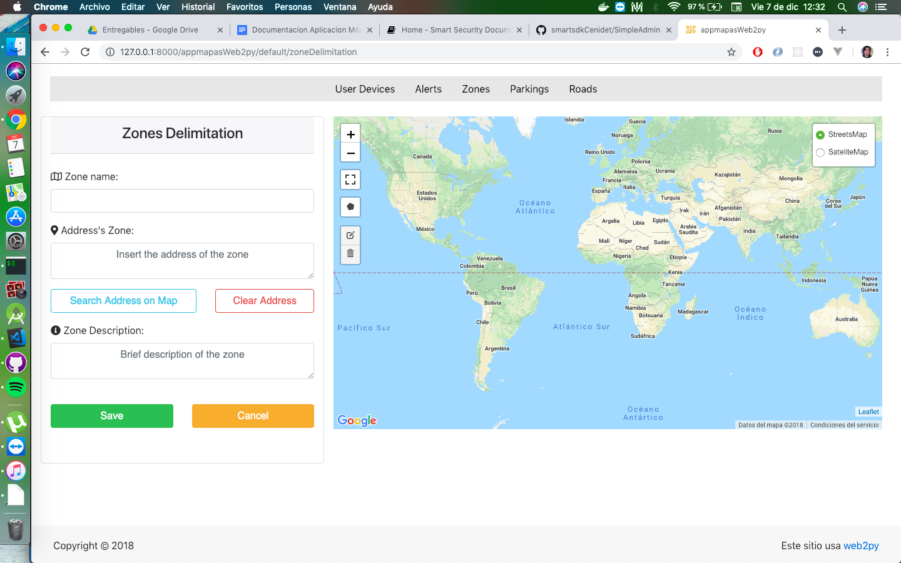

#### Administración de estacionamientos en el sistema

La administración de estacionamientos en el sistema está compuesto por dos vistas: la lista de estacionamientos y el registro de nuevos estacionamientos.

#### Lista de Estacionamientos 

La lista de Estacionamientos registrados en la aplicación presenta la información relevante de cada estacionamiento como: el nombre, su descripción y el nombre de la zona del estacionamiento. Además, cada registro de estacionamiento contiene un botón para eliminar dicho registro de la lista; este registro se elimina de manera lógica en el sistema. En la parte superior derecha del listado la vista muestra el botón Add new parking, el cual redirige a la vista de Registro de Estacionamiento para crear nuevos estacionamientos en el sistema. La imagen siguiente muestra esta vista.

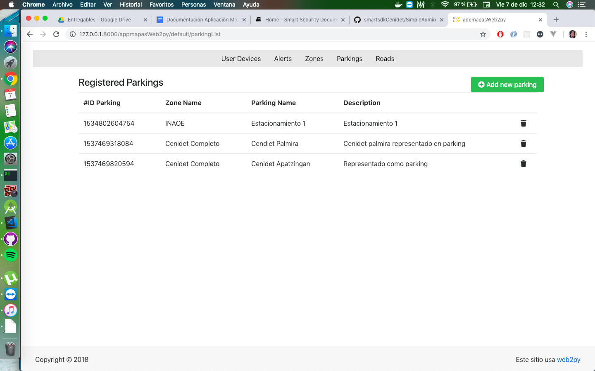

#### Registro de Estacionamiento 

La vista de Registro de Estacionamientos muestra un formulario para la creación de nuevos estacionamientos, en este formulario se deben registrar datos del estacionamiento como: la zona a la que pertenece dicho estacionamiento, su categoría, nombre y una descripción del estacionamiento. Por último, se debe delimitar el área del estacionamiento en el mapa con ayuda de la herramienta del polígono.  Cuando haya registrado los datos del estacionamiento y su delimitación en el mapa, presione el botón Save   para registrar el nuevo estacionamiento en el sistema. La imagen siguiente muestra esta vista.

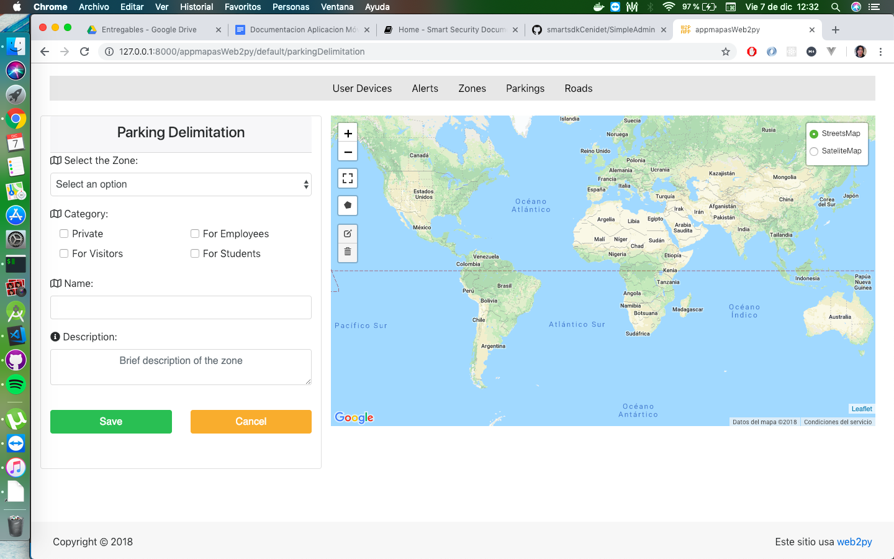

#### Administración de calles y segmentos de calles

La administración de calles y segmentos en el sistema está compuesta por tres vistas: la lista de calles, la lista de segmentos de calles y, el registro de calles y segmentos de calles.

#### Lista de Calles

La lista de calles registradas en la aplicación presenta la información relevante de las calles como: el nombre, su descripción, y la zona responsable de la calle. Además, cada registro de calle  contiene un botón para eliminar dicho registro de la lista; este registro se elimina de manera lógica en el sistema. En la parte superior derecha del listado de calles la vista muestra dos botones: See roadSegments y Add new Road and Segments. El botón See roadSegments redirige a la vista del listado de segmentos de calles y el botón Add new Road and Segments redirige a la vista de creación de calles y segmentos de calles.

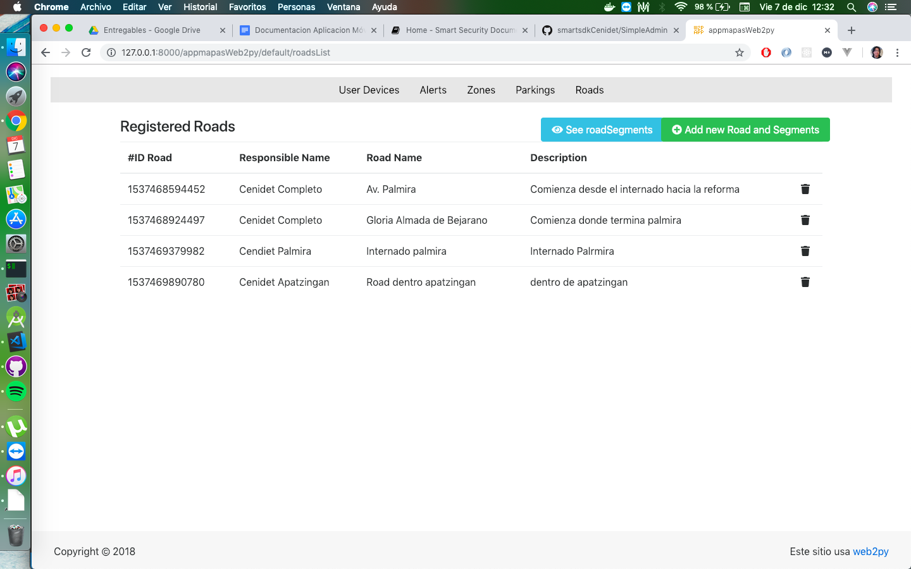

#### Lista de Segmentos de Calles

La lista de segmentos de calles registrados en el sistema muestra la información de los segmentos de calles como: el nombre del segmento de calle, el nombre de la calle, el sentido de la calle, la velocidad permitida del segmento de calle y el ancho de la calle en metros. Además, cada registro de segmento de calle contiene un botón para eliminar dicho registro de la lista; este registro se elimina de manera lógica del sistema. En la parte superior del listado la vista presenta el botón Add new Road and Segments, el cual redirige a la vista de creación de calles y segmentos de calles.

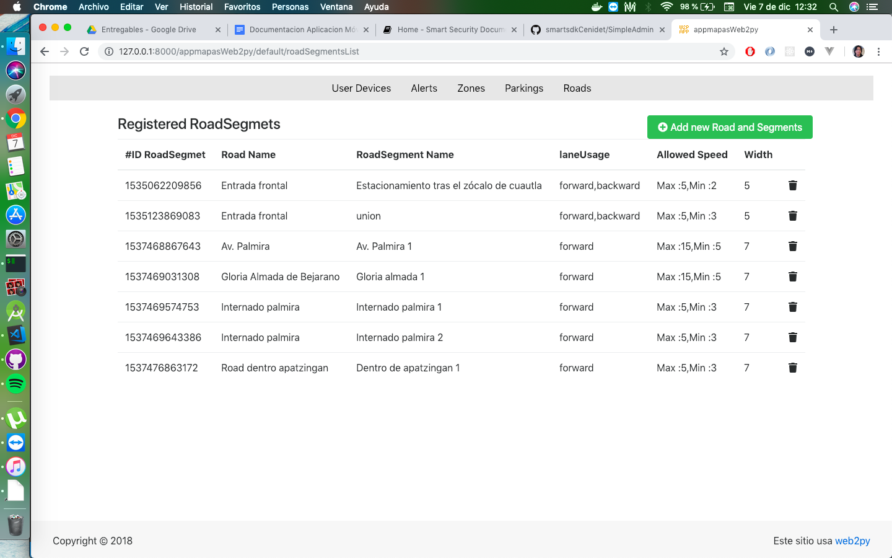

#### Registro de calle y segmento de calle

La vista de Registro de calle y segmento de calle muestra un formulario para la creación de nuevos segmentos de calles. Para registrar un segmento de calle se deben seleccionar e ingresar los datos siguientes en la vista.  

1. Seleccionar si el segmento de calle pertenece a una calle que está dentro de un estacionamiento o a una zona.  
    - Si el segmento de calle pertenece a una calle de una zona, seleccione la zona y el nombre de la calle. 
    - Si el segmento de calle pertenece a una calle de un estacionamiento, seleccione: la zona del estacionamiento, el nombre del estacionamiento y el nombre de la calle.  

2. Ingresar el nombre del segmento de calle, su velocidad mínima y máxima, el sentido de la calle y el ancho de la calle en metros.   

3. Delimite la calle con la herramienta de dibujo de poli línea. Cuando haya registrado los datos del estacionamiento y su delimitación en el mapa, presione el botón Save   para registrar el nuevo estacionamiento en el sistema.

4. Presionar el botón Save  para registrar los datos del segmento de calle y su delimitación.  

La imagen siguiente muestra la vista de registro de segmentos de calles.

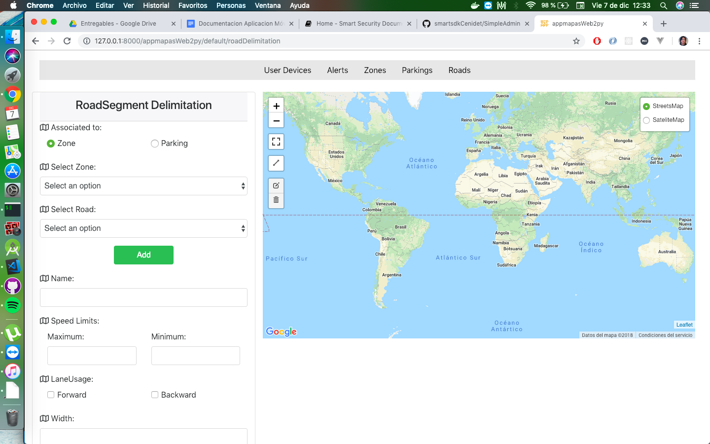

Si la calle principal del segmento no está registrada en el sistema, puede crear una nueva calle presionando el botón Add, este muestra un formulario para registrar una nueva calle y relacionar el segmento de calle con la calle principal. Cuando registre los datos de la calle presione el botón Save Road para almacenar la información en el sistema y continúe con el registro del segmento de calle. La imagen siguiente muestra la vista del registro de calle.

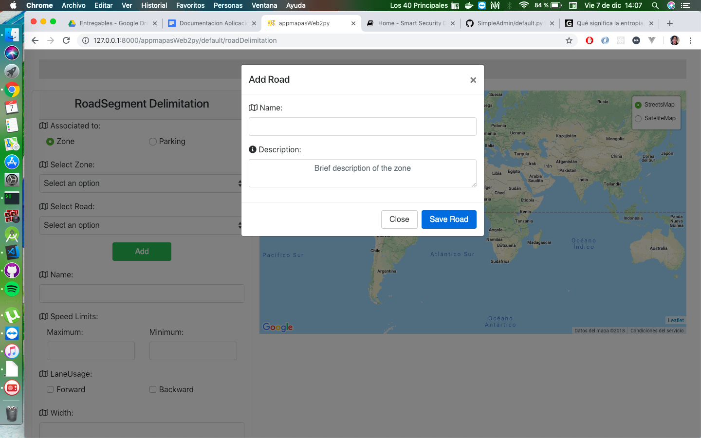

#### Búsqueda de usuarios en zonas

La aplicación de administración incluye un módulo de búsqueda de usuarios. Este módulo tiene la función buscar si un usuario está o estuvo en una zona registrada en una fecha y hora determinadas, además de buscar todos los usuarios que se están dentro de una zona. Estos tres tipos de búsquedas se describen a continuación:

#### 1. Búsqueda de usuario que estuvo en una zona 

La búsqueda de usuario que estuvo en una zona muestra un formulario para ingresar los datos de búsqueda, estos datos son: la zona de búsqueda, el número de teléfono del usuario y,  la fecha y hora de búsqueda. Cuando haya ingresado estos datos presione el botón Consult  para realizar la búsqueda. Si el sistema encuentra el registro del usuario en la zona, fecha y hora indicadas, este muestra la última ubicación del usuario en el mapa.   La imagen siguiente muestra la vista de esta búsqueda.

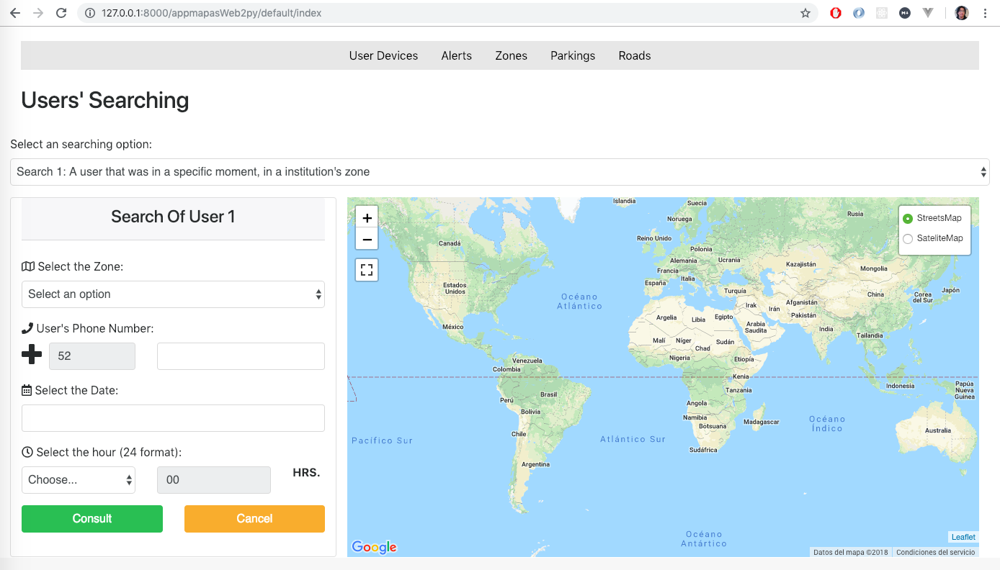

#### 2. Búsqueda de usuario que está en una zona

La búsqueda de usuario que está una zona muestra un formulario para ingresar los datos de la búsqueda, estos datos son: seleccionar la zona de búsqueda e ingresar el número de teléfono del usuario. Cuando haya ingresado esto estos datos presione le botón Consult para realizar la búsqueda. Si el sistema encuentra al usuario en la zona, este muestra en el mapa su ubicación actual. La imagen siguiente muestra la vista de esta búsqueda.

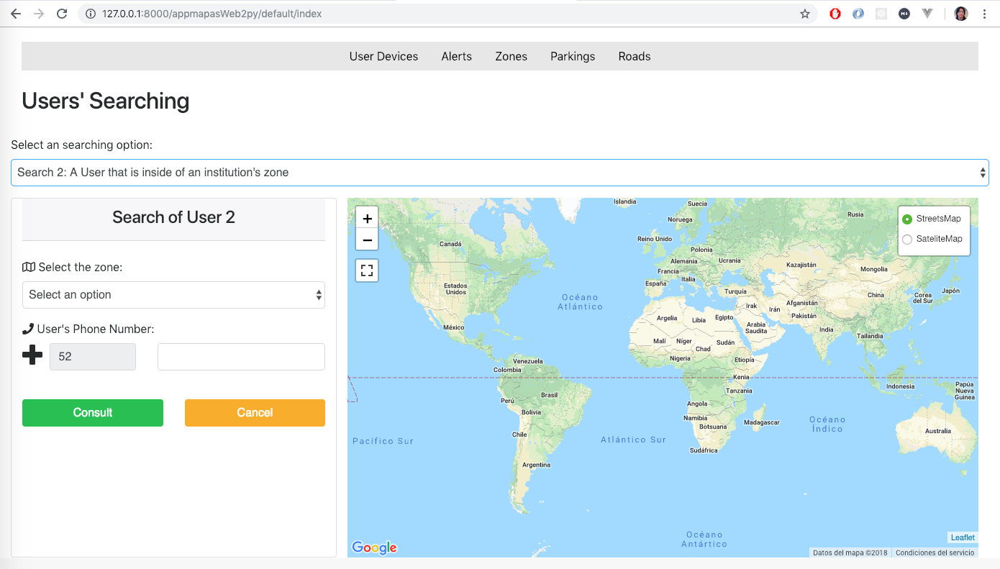

#### 3. Búsqueda de usuarios en una zona

La búsqueda de usuarios en una zona muestra un formulario para seleccionar la zona de búsqueda de los usuarios. Cuando haya seleccionado la zona de búsqueda presione el botón Consult. Si el sistema encuentra usuarios dentro de la zona, este muestra en el mapa la ubicación actual de los usuarios. La vista siguiente muestra la imagen de esta búsqueda.

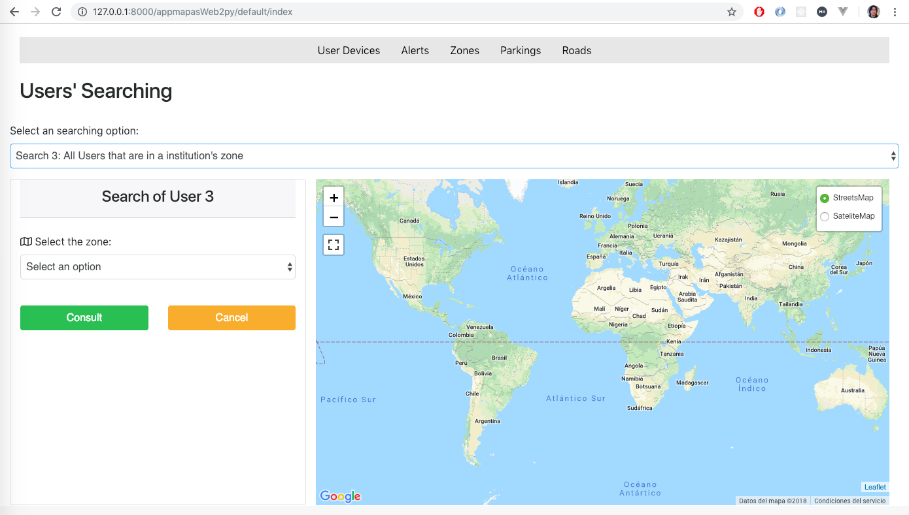

#### Panel de Alertas

El panel de alertas presenta dos tipos de búsquedas de alertas: el historial de alertas y las alertas actuales. Para mostrar la ubicación de las alertas en el mapa seleccione en el formulario la zona y el tipo visualización de alertas.  La opción History Alerts muestra en el mapa la ubicación de las últimas 10 alertas y la opción Current Alerts muestra la ubicación de las alertas del día. Cuando haya seleccionado las opciones en el formulario presione el botón Consult. Si el sistema encuentra alertas con los parámetros seleccionados, este muestra la ubicación de las alertas en el mapa.

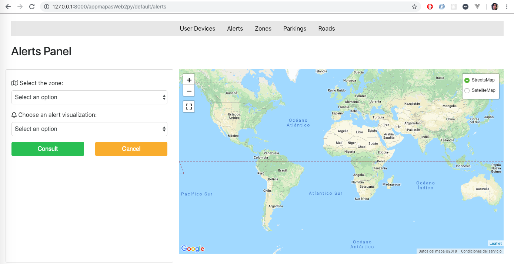

### Administración de bases de datos 

Los datos de DrivingApp están administrados por tres Sistemas gestores de bases de datos: MariaDB, Mongo DB y CrateDB. La siguiente imagen muestra un diagrama relacional de las entidades. 

Las entidades almacenadas en  MariaDB se muestran en el diagrama en color amarillo, la base de datos administra las entidades en MariaDB se llama smartsdksecurity. Las entidades almacenadas en MongoDB se muestran en el diagrama color verde, la base de datos de estas entidades es administrada por el Orion ContextBroker para almacenar la información de contexto de cada entidad. Las entidades  almacenadas en CrateDB  registran los datos históricos de las entidades administradas por el Orion ContextBroker, estas entidades se muestran en el diagrama en color rojo.

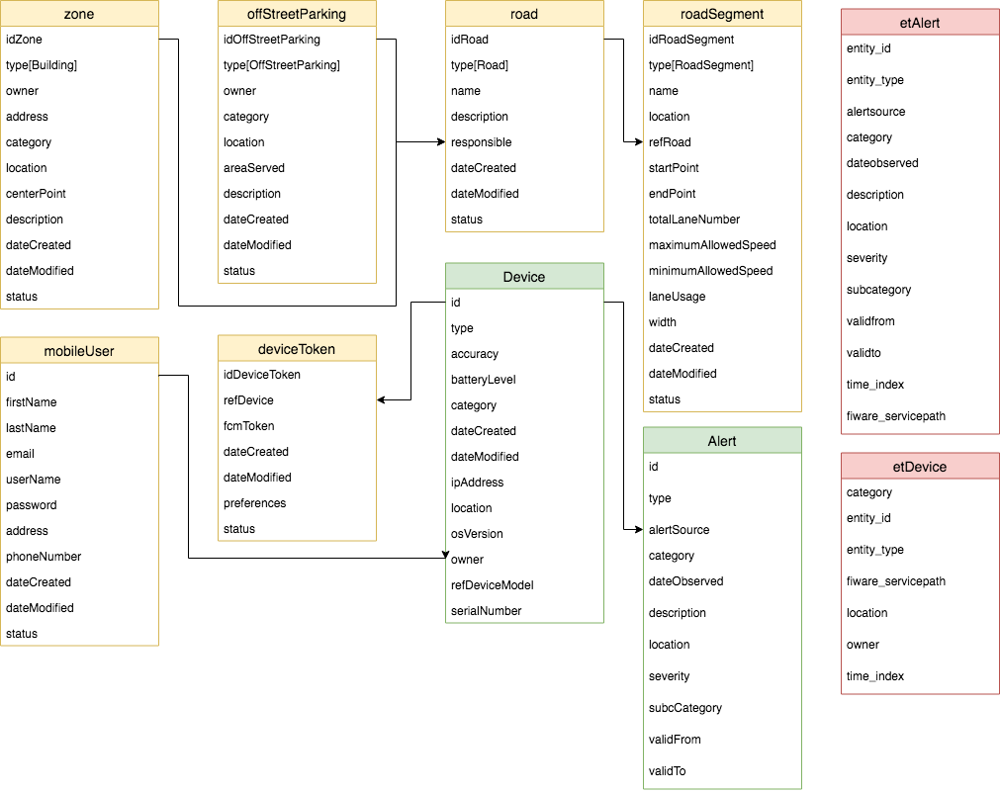

Tablas de la base de datos smartsecurity en MYSQL

- zone: La tabla zone está basada en el modelo de datos [Building]( https://github.com/Fiware/dataModels/tree/master/specs/Building/Building) de FIWARE. 
- offStreetParking: La tabla offStreetParking está basada en el modelo de datos [OffStreetParking](https://github.com/Fiware/dataModels/tree/master/specs/Parking/OffStreetParking) de FIWARE. 
- road: La tabla road está basada en el modelo de datos [Road]( https://github.com/Fiware/dataModels/tree/master/specs/Transportation/Road) de FIWARE. 
se utiliza en la aplicación SmartSecurity para definir las calles de estacionamiento de una organización. También este modelo de datos se utiliza para definir las calles que están dentro del espacio geográfico de la organización utilizando el atributo responsible.
- roadSegment: La tabla roadSegment está basada en el modelo de datos de [RoadSegment]( https://github.com/Fiware/dataModels/tree/master/specs/Transportation/RoadSegment) de FIWARE, este  se utiliza en la aplicación Smart Security para describir las características de los segmentos en los que se puede dividir una calle; además, este modelo proporciona atributos para detallar las propiedades de las líneas o carriles que contiene el segmento de la calle.
- mobileUser: La tabla mobileUser está basada en el modelo de datos User diseñado para el escenario de seguridad inteligente. Este modelo cumple con los atributos básicos utilizados para el servicio de autenticación de FIWARE, el  Identity Manager – Keyrock.
- deviceToken: La tabla deviceToken está basada en el modelo de datos DeviceToken diseñado para completar la información de los dispositivos, representada en el modelo de datos Device de FIWARE. El modelo DeviceToken incluye atributos para el funcionamiento del envío y administración de notificaciones push en aplicación móvil.  

Entidades de contexto del Orion ContextBroker almacenadas en MongoDB  

- Device: Las entidades Device están basadas en el modelo de datos [Device]( https://github.com/Fiware/dataModels/blob/master/specs/Device/Device/) de FIWARE, utilizando los atributos requeridos y algunos opcionales.
- Alert: Las entidades Alert están basadas en el modelo de datos [Alert]( https://github.com/Fiware/dataModels/blob/master/specs/Alert/.) de FIWARE 

Tablas de la base de datos de series de tiempo en CrateDB  

- etDevice: La tabla etDevice está basada en el modelo de datos [Device]( https://github.com/Fiware/dataModels/blob/master/specs/Device/Device/) de FIWARE. La API de QuantumLeap convierte las entidades de modelo Device del Orion en registros relacionales, para almacenarlos en la base de datos CrateDB. Para más información consulte esta [sección]( https://smartsdk.github.io/ngsi-timeseries-api/user/#data-insertion) en la documentación oficial de QuantumLeap. 
- etAlert: La tabla etAlert está basada en el modelo de datos [Alert] de FIWARE. La API de QuantumLeap convierte las entidades de modelo Alert del Orion en registros relacionales, para almacenarlos en la base de datos CrateDB. Para más información consulte esta [sección](https://smartsdk.github.io/ngsi-timeseries-api/user/#data-insertion) en la documentación oficial de QuantuamLeap.


