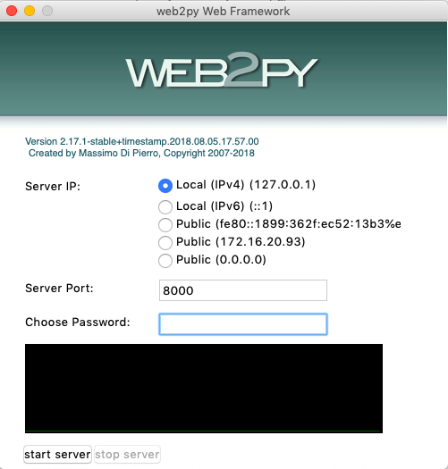
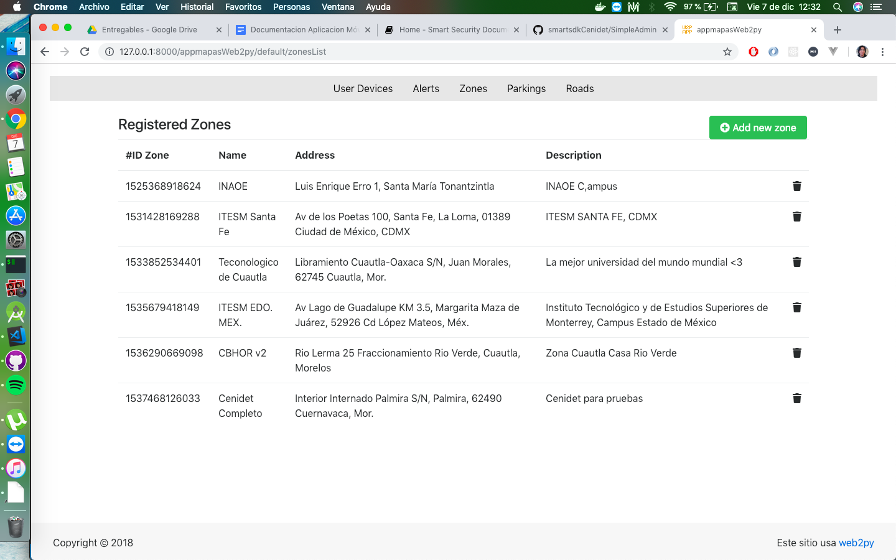

## DrivingApp System Administration

This Guide provides information about how to administer the DrivingApp application system. The following describes the administration applications that can be used with DrivingApp, in addition to the administration of the application databases.

### ViVA

ViVA is a Video Surveillance application that aims to support the security guard to prevent situations of risk and consequently improve the quality of life of the people who live in the monitored area. The ViVA application focuses on detecting and analyzing risk situations, such as: theft, access control, people detection, fights, crowd analysis, etc., through the combination of video cameras and sensors, both indoors and outdoors scenarios. For example, parking lots and buildings. You can check the documentation of ViVA at the following [link](https://video-surveillance-application.readthedocs.io/en/latest/).

ViVA includes modules for data management of zones, parking lots and streets; these modules are necessary for the DrivingApp application to work properly. In addition, ViVA has a module to consult the location of the users of DrivingApp that are, or who were within any of the registered zones. You can access the ViVA web application in [this](https://viva-smartsdk.duckdns.org/) link.

### DrivingApp Administration Application

In order to offer a lightweight tool that includes area management modules and user location consultation, a simple administration application for DrivingApp was developed using the Web2py framework. This administration application contains the modules that ViVA includes to manipulate the information of zones, parking lots and streets, as well as to consult the location of the users of DrivingApp. The source code of this application is on this [repository](https://github.com/smartsdkCenidet/SimpleAdmin).

#### Requeriments

- **Git version control system**, you can check the official documentation of Git in the following [link](https://git-scm.com/).
- **Python 2.7.X**, you can check how to install Python on your operating system in the following [link](https://www.python.org/downloads/release/python-2715/).

#### Installation and running

1.- Download the web2py project with the following git command: 
```sh
$ git clone --recursive https://github.com/web2py/web2py.git
```
2.-	Download the SimpleAdmin project inside the /applications folder of the web2py project.

Use the following command to move to the applications folder:
```sh
$ cd applications
```

Run the following command to download the SimpleAdmin project inside the applications folder:
```sh
$ git clone https://github.com/smartsdkCenidet/SimpleAdmin.git
```

3.-	Finally, run the file web2py.py, this file is in the main folder of the web2py project .

Remember to change the folder with the command:
```sh
$ cd ..
```

Then, use the following command to run the web2py application: 
```sh
$ python web2py.py
```

This command displays a window where it is necessary to configure a password for the server, as shown in the following image:



After typing the password, click on the Start Server button and the server will start running. Now you can access the SimpleAdmin application at the following address:[http://127.0.0.1:8000/appmapasWeb2py/default/index](http://127.0.0.1:8000/appmapasWeb2py/default/index).

#### Configuration

The configuration of the application must be updated by changing the address of the DrivingApp Service. This configuration is updated by modifying the smartService variable in the default.py file located in the controllers folder of the application. Example:

> smartService = T('http://0.0.0.0:4005')

#### Manual of the administration app of DrivingApp

The following manual describes the functions of each view of the SimpleAdmin application, for the administration of the DrivingApp system.

#### Map Tools in SimpleAdmin App 

The tools of the maps in the administration application are the following:

- **Map in full screen**: this functionality allows you to see the map to the size of the screen. Activate this option by pressing the box button on the map tools. To exit full screen you can use the Esc key on your keyboard or the same box button of the map tools.
- **Satellite View**: this functionality allows you to see the map in satellite view. You can activate this option by selecting the SateliteMap option in the upper right part of the map.
- **Streets View**: this functionality allows you to see the map with streets view. You can activate this option by selecting the StreetsMap option at the upper right part of the map. This option is selected by default on the map.
- **Zoom**: the + and - tools allow you to zoom in or zoom out the map area as needed.
- **Drawing tools**: Among the drawing tools are, the tool to delimit a new area, polygon; the tool to delimit street segments, polyline; and the tool to eliminate the marked area, the trash can. The edit tool is disabled in this version of the system.

#### Zones administration in the system

The administration of zones in the system consists of two views: the list of zones and the registration of new zones.

#### List of zones

The view of list of zones presents the relevant information of each zone registered in the application, such as: name, address and description. In addition, each zone record contains a button to remove that record from the list; this record is eliminated logically in the system. In the upper right part of the list, the view shows the **Add new zone** button, which is used to go to the Zone Registration view and create new zones in the system. The following image shows an example of this view.



#### Zones Registration

The zone registration view shows a form for the creation of new zones, in this form you must register the data of the zone as: the name, the address and a description of the zone. It is important that the address of the area is a real address. When you type the address of the area in the text field, press the **Search Address on Map** button to search the address of the area on the map. This search is done using a Google Maps API, centering the map center on the direction of the area. Finally, you must define the area of the zone on the map with the  polygon tool. When you have registered the zone data and marked its delimitation on the map, press the **Save** button to register the new zone in the system.
The following image shows an example of this view.


#### Parking lots administration in the systema

The administration of parkings in the system consist of two views: the list of parking lots and the registration of new parking lots.

#### Parking lots List 

The view of list of Parking lots presents the relevant information of each parking lot registered in the system as: the name, its description and the name of the parking area. In addition, each parking record contains a button to remove that record from the list; this record is eliminated logically in the system. In the upper right part of the list, the view shows the **Add new parking** button, which redirects to the Parking Registration view to create new parking lots in the system. The following image shows this view.


#### Parking lot registration

The Parking lots registration view shows a form for the creation of new parking, in this form you must register the parking information such as: the area to which the parking belongs, its category, the name and a description of the parking lot. Finally, you must define the parking area on the map with the polygon tool. Once you have registered the parking information and marked its delimitation on the map, press the **Save** button to register the new parking in the system. The following image shows this view.


#### Roads and Roads Segments administration in the system

The administration of roads and roads segments in the system consist of three views: the list of roads, the list of roads segments, and the roads and roads segments registration.

#### Roads List

The Roads list view presents the relevant information of each road registered in the system as: the name, its description, and the area responsible for the road. In addition, each road record contains a button to remove that record from the list; this record is eliminated logically in the system. In the upper right part of the roads list, the view shows two buttons: **See roadSegments** and **Add new Road and Segments**. The **See roadSegments** button redirects to the view Road segments list and the **Add new Road and Segments** button redirects the view to create new road and road segments.


#### Roads Segments List

The Roads segments list view shows the data of each road segment registered in the system as: the name of the road segment, the name of the road, the direction of the road, the allowed speed and the width of the road in meters. In addition, each road segment record contains a button to remove that record from the list; this record is removed logically from the system. At the top of the list, is shown **Add new Road and Segments** button, which redirects the view to create roads and road segments.


#### Road and Roads Segments registration

The road registration  and the road segment view shows a form for creating new street segments. To register a segment of road, you must select and enter the following data in the view.

1. Select if the road segment belongs to a parking lot or an zone. 
    - If the road segment belongs to a road of an area, select the zone and consequently the name of the road. 
    - If the road segment belongs to a road of a parking lot, select: the zone of the parking, the name of the parking lot and the name of the road. 

2. Enter the name of the road segment, its minimum and maximum speed, the direction of the segment and the width of the segment in meters. 

3. Delimit the segment with the polyline tool. 

4. Press the Save button to record the data of the road segment and its delimitation. 

La following image shows the view of roads segments registration.


If the main road of the segment is not registered in the system, you can create a new road by pressing the **Add** button, this shows a form to register a new road and link the road segment to this road. When registering the road data press the **Save Road** button to store the information in the system and continue with the road segment registration. The following image shows the road registration view.


#### Searhes of users in zones 

The administration application includes a user search module. This module has the function to search if a user is or was in a zone registered in a certain date and time, besides looking for all the users that are inside a zone. These three types of searches are described below:

#### 1. Search of user that was in a zone  

The user search that was in a zone shows a form to enter the search data, these data are: the search area, the user's phone number and the search date and time. When you have entered this information, press the Consult button to perform the search. If the system finds the user's record in the zone, date and time indicated, it shows the user's last location on the map. The following image shows the view of this search.


#### 2. Search of user that is in a zone

The user search that is a zone shows a form to enter the search data, these data are: select the search area and enter the user's phone number. When you have entered this information, press the Consult button to perform the search. If the system finds the user in the zone, it shows on the map its current location. The following image shows the view of this search.


#### 3. Search of users in a zone

The search of users in a zone shows a form to select the user's search area. When you have selected the search area, press the Consult button. If the system finds users within the zone, it shows on the map the current location of the users. The following view shows the image of this search.


#### Alerts Panel

The alerts panel presents two types of alert searches: alert history and current alerts. To show the location of alerts on the map, select the zone and type of alert display in the form. The Alert History option shows the location of the last 10 alerts on the map and the Current Alerts option shows the location of the day's alerts. When you have selected the options in the form, press the Consult button. If the system finds alerts with the selected parameters, it shows the location of the alerts on the map.


### Administración de bases de datos 

DrivingApp data is managed by three database management systems: MariaDB, Mongo DB and CrateDB. The following image shows a relational diagram of the entities.

The entities stored in MariaDB are shown in the diagram in yellow, the database of these entities is called smartsdksecurity. The entities stored in MongoDB are shown in the diagram in green, the database of these entities is managed by the Orion ContextBroker to store the context information of every entity. The entities stored in CrateDB contains the historical data of the entities managed by the Orion ContextBroker, these entities are shown in the diagram in red color.


Tables of the smartsecurity database in MariaDB

- zone: The table zone is based on the [Building]( https://github.com/Fiware/dataModels/tree/master/specs/Building/Building) data model of FIWARE. This model is used in SmartSecurity application to define the area of a organization or institution. 
- offStreetParking: The table offStreetParking is based on the [OffStreetParking](https://github.com/Fiware/dataModels/tree/master/specs/Parking/OffStreetParking) data model of FIWARE. This model is used to define the parking lots in the zone of a organization.
- road: The table road is based on the [Road]( https://github.com/Fiware/dataModels/tree/master/specs/Transportation/Road) data model of FIWARE.  This model is used in the SmartSecurity application to define roads of the parking lots of a organization; and is also used to define the roads within of the zone of the organization using the responsible attribute.
- roadSegment: The table roadSegment is based on the [RoadSegment]( https://github.com/Fiware/dataModels/tree/master/specs/Transportation/RoadSegment) data model of FIWARE. This model is used in the Smart Security application to describe the characteristics of the segments in which is divided a road. In addition, this model provides attributes to detail the properties of the road lanes. 
- mobileUser: The table mobileUser is based on the User data model design for the smart security scenario. This model fulfill with basic attributes used for the authentication service of FIWARE, the Identity Manager - Keyrock. 
- deviceToken: The table deviceToken is based on the DeviceToken data model, design it for complete the devices information represented in the Device data model of FIWARE. The DeviceToken model includes attributtes for the sending and administration of push notifications in the mobile app. 

Context entities from the Orion ContextBroker stored in MongoDB 

- Device: The entities Device are based on the [Device]( https://github.com/Fiware/dataModels/blob/master/specs/Device/Device/) of FIWARE
- Alert: The Alert entities are based in the [Alert]( https://github.com/Fiware/dataModels/blob/master/specs/Alert/) of FIWARE.

Tables of the time series databse in CrateDB  

- etDevice: The table etDevice is based on the [Device]( https://github.com/Fiware/dataModels/blob/master/specs/Device/Device/) data model of FIWARE. 
- etAlert: The table etAlert is based on the [Alert](https://github.com/Fiware/dataModels/blob/master/specs/Alert/) data model of FIWARE.  

The QuantumLeap API converts the Device entities of the Orion in relational records, to store them in the CrateDB database. For more info visit this [section]( https://smartsdk.github.io/ngsi-timeseries-api/user/#data-insertion) in the official documentation of QuantumLeap. 


