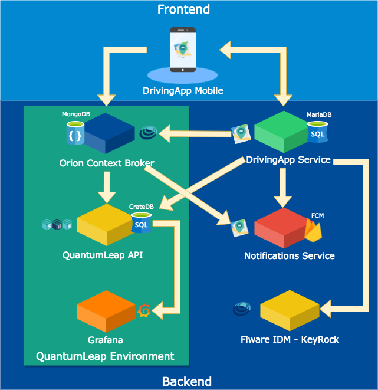

## Arquitectura del sistema de DrivingApp

The architecture of the DrivingApp system is composed of two layers: the fronted and the backend. The following image shows the components of the architecture in each of its layers.

### Fronted

The Frontend layer of the DrivingApp system contains the end-user applications. The architecture shows in the Fronted layer the mobile application DrivingApp, however if you want to add another application to this project, you can include it within the Frontend layer.

The mobile application DrivingApp constantly sends **(1)** to the Orion ContextBroker the device data, and the alert entities created by the user of the application. In addition, the DrivingApp application uses **(2)** the services of DrivingApp Service to perform queries functions and data models administration. 

### Backend

The Backend layer is composed by the services and DBMS that the DrivingApp application uses. The services can be broadly classified into three types: the QuantumLeap environment services, the specific use services for the DrivingApp application and the IDM-Keyrock authentication service.

#### Servicios del Entorno QuantumLeap

El entorno QuantumLeap es un conjunto de servicios que permiten almacenar datos FIWARE-NGSIv2 en series de tiempo, y representarlos de manera gráfica para facilitar su monitoreo. A continuación se describen los servicios que componen el entorno QuantumLeap.

##### Orion ContextBroker

El Orion ContextBroker es una implementación en C ++ de  la API REST NGSIv2 desarrollado como parte de la plataforma FIWARE. Este componente permite administrar todo el ciclo de vida de la información de contexto y su disponibilidad; incluyendo actualizaciones, consultas, registros y suscripciones. Utilizando el Orion ContextBroker, es posible crear elementos de contexto y administrarlos a través de actualizaciones y consultas. Además, con el Orion ContextBroker es posible suscribir aplicaciones a cambios en la información de contexto; es decir, cuando nueva información de contexto sea creada o actualizada,  las aplicaciones reciben una notificación. El Orion ContextBroker almacena la información de contexto en una base de datos de MongoDB. Los escenarios de uso y el detalle de funciones del Orion ContextBroker se describen en la documentación oficial de este componente, la cual puede consultar en el siguiente [enlace](https://fiware-orion.readthedocs.io/en/master/).  

El Orion ContextBroker administra la información de contexto de los dispositivos de usuarios que utilizan la aplicación DrivingApp, además de las alertas generadas por estos usuarios **(2)**.  
La información de contexto de dispositivos y de alertas almacenada en el Orion ContextBroker es consultada constantemente **(3)** por DrivingApp Service.  

El Orion ContextBroker establece comunicación **(4)** con la API de QuantumLeap para enviar a este los datos de las entidades Device y Alert registradas en el Orion. La comunicación entre el Orion ContextBroker y la API de QuantumLeap es configurada a través de dos suscripciones, una para las entidades Device y otra para las entidades Alert. Cada una de estas suscripciones indica: la dirección de la API de QuantumLeap a la que el Orion ContextBroker envía la entidad, además de los atributos específicos de la entidad para almacenarlos en la base de datos de CrateDB.  Para conocer más acerca de las suscripciones, puede consultar el apartado [Subscriptions](https://fiware-orion.readthedocs.io/en/master/user/walkthrough_apiv2/index.html#subscriptions) de la documentación oficial del Orion ContextBroker.

El Orion ContextBroker notifica **(5)** a Notifications Service cuando una nueva entidad de alerta es creada. La notificación que envía el Orion ContextBroker al servicio Notificiations Sevice  se configura a través de la creación de una suscripción, esta indica: el tipo de entidades a las que se aplica la suscripción (entidades de tipo Alert), la dirección de Notifications Service  y los atributos que deben contener las entidades de tipo Alert.

##### QuantumLeap API

QuantumLeap API es la primera implementación de una API escrita en Python que soporta el almacenamiento de datos FIWARE-NGSIv2 en una base de datos de series de tiempo. Si se desea aprender más acerca de  QuantumLeap puede consultar su documentación oficial en el este [enlace](https://quantumleap.readthedocs.io/en/latest/).

La API de QuantumLeap recibe los datos notificados por el Orion ContextBroker y los convierte a los tipos de datos soportados por CrateDB, para su almacenamiento en la base de datos.

##### CrateDB

CrateDB es un sistema de administración de bases de datos SQL distribuidas, e integra un almacén de datos orientado a documentos con capacidad de búsqueda. Es de código abierto y escrito en Java. Para conocer más acerca de CrateDB puede consultar su documentación en el siguiente [enlace](https://crate.io/docs/).

##### Grafana

Grafana es una aplicación web que sirve para monitorear grandes conjuntos de datos, a través de la creación de gráficos que interpretan en tiempo real  los datos obtenidos de diversas fuentes de datos. Para conocer más acerca de Grafana, consulte su documentación oficial en el siguiente [enlace](http://docs.grafana.org/).

#### Servicios de uso específico para DrivingApp

Los servicios diseñados para uso la aplicación DrivingApp son dos servicios web descritos brevemente a continuación. 

##### DrivingApp Service

DrivingApp Service es un servicio web que manipula los modelos de datos públicos y privados de la aplicación móvil, además de proporcionar servicios de consulta. Para mayor información consulte la sección [Servicios Web](./webServices.md#servicios-web).

##### Notifications Service

Notifications Service es un servicio web que manipula la información de las entidades de Alerta enviadas por el Orion ContextBroker a través de la notificación de una suscripción. Para más información consulte la sección [Servicios Web](./webServices.md#servicios-web).

#### Servicio de Autenticación de FIWARE

El IDM- Keyrock es un habilitador genérico de FIWARE que ofrece herramientas de administración para soportar las funciones del ciclo de vida del usuario como: acceso a redes, servicios y aplicaciones, incluida la autenticación segura y privada de usuarios a dispositivos, redes y servicios. Además, Identity Management se utiliza para autorizar a servicios extranjeros a acceder a datos personales almacenados en un entorno seguro. Por lo general, el propietario de los datos debe dar su consentimiento para acceder a los datos; esto implica también la autenticación del usuario. Para más información de este componente consulte su documentación en este [enlace](https://github.com/ging/fiware-idm-deprecated).
