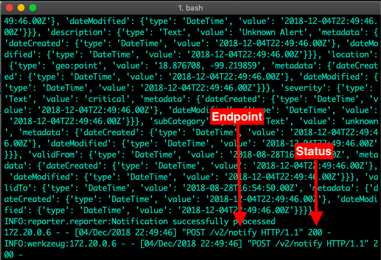
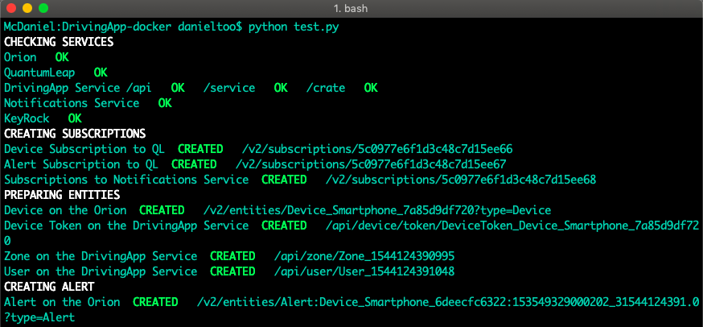
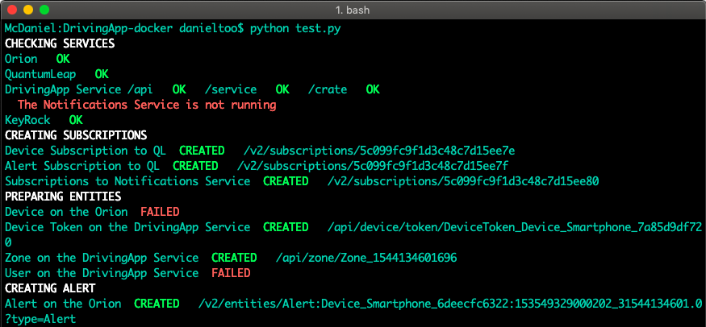
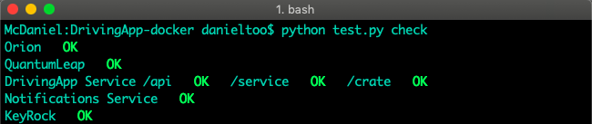
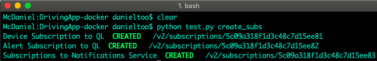
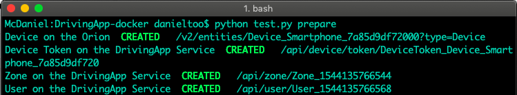
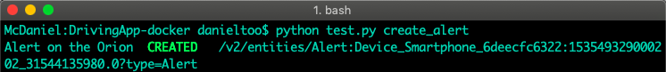

## [Chequeo manual de ejecución de servicios en contenedores Docker](#chequeo-manual-de-ejecucion-de-servicios)

Para verificar que los servicios se comunican correctamente, es necesario revisar los logs de los contenedores docker de QuantumLeap y Notifications Service. Para revisar estos contenedores sigua las siguientes instrucciones:

1.- Ejecutar el siguiente comando en consola para revisar los logs del contenedor QuantumLeap:

```sh
$ docker logs drivingapp-docker_quantumleap_1
```

La siguiente imagen muestra la petición HTTP de tipo POST a la ruta /v2/notify de QuantumLeap, señalada con flechas rojas. La respuesta que retorna QuantumLeap  a esta petición es de `status: 200`, lo que significa que la conexión entre el Orion ContextBroker y QuantumLeap se realizó de manera correcta.



2.- Ejecutar el siguiente comando en consola para revisar los logs de Notifications Service:

La siguiente imagen muestra la petición HTTP de tipo POST a la ruta /notify de Notifications Service, señalada con flechas rojas. La respuesta que retorna Notifications Service a esta petición es de status 201, lo que significa que la conexión entre el Orion Context Broker y Notifications Service se realizó de manera correcta.


***NOTA***: El nombre de los contenedores de QuantumLeap y de Notifications Service pueden cambiar, esto depende de diversos factores como: el nombre de la carpeta o el número de veces que se ejecutan los contenedores con docker compose. 

Para  verificar el nombre de los contenedores docker utiliza el comando:

```sh
$ docker ps 
```

## Chequeo Automático de Ejecución de Servicios

El chequeo automático de ejecucion de servicios se realiza a través del script en Python **test.py**. Este script realiza automáticamente la creación de las suscripciones necesarias y la ejecución de las pruebas unitarias de servicios. Para ejecutar este el script **test.py** siga las siguientes indicaciones: 

### Requerimientos

- Python 2.7.X, consulte este [enlace](https://www.python.org/downloads/release/python-2715/) para más información acerca de cómo instalar Python en su sistema operativo.

### Ejecutar Script

Escriba el siguiente comando en consola para ejecutar el script test.py, dentro de la carpeta de DrivingApp-docker:

```sh
$ python test.py
```

Si el script no encontró ningún fallo en el despliegue de servicios, el resultado en consola mostrará lo siguiente: 



El script muestra en consola los siguientes mensajes:

- El mensaje "OK" en color verde que indica que las acciones se efectuaron correctamente.
- El mensaje "CREATED" de color verde que indica la creación correcta de las entidades en cada servicio. Junto a este mensaje se muestra la dirección del servicio para consultar la entidad creada.

***NOTA***: El script **test.py** no verifica la comunicación entre servicios, para esto es necesario revisar de forma manual los logs de los contenedores docker de QuantumLeap y Notifications Service, tal como se describe en  esta [sección](#chequeo-manual-de-ejecucion-de-servicios)

La siguiente imagen muestra un ejemplo de algunos errores que puede retornar el script **test.py**, marcados en color rojo.



El script **test.py** le permite ejecutar la revisión de cada servicio de manera separada. A través de comandos se puede verificar que los servicios se ejecutan correctamente y crear de suscripciones de cada servicio; además de ejecutar las pruebas de funcionalidad de cada servicio. A continuación se indican los comandos utilizados en el script para realizar cada una de estas acciones.

1.- Para revisar la ejecución correcta de cada servicio utilice en siguiente comando en consola:

```sh
$ python test.py check
```



2.- Para crear las suscripciones en el Orion ContextBroker utilice el siguiente comando en consola:

```sh
$ python test.py create_subs
```



3.- Para ejecutar las pruebas de funcionalidad de cada servicio se realiza lo siguiente:  

- Preparar los servicios creando entidades de prueba utilizadas por cada servicio del sistema. El comando para preparar los servicios es: 

```sh
$ python test.py prepare
```

  

- Crear una entidad de alerta para verificar la comunicación entre los servicios desplegados, utilizando el siguiente comando:

```sh
$ python test.py create_alert
```



***NOTA***: Cada vez que es utilizado este comando se crea una alerta con id diferente. Observe que en la sección de [integración de servicios](./tests.md#creacion-de-entidades-para-la-integracion-de-servicioss) se crea también una alerta en el paso 5 pero con un id determinado. 