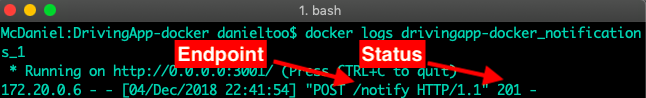

## [Manual health check](#manual-health-check)

To verify that the services communicate correctly, it is necessary to check the logs of docker containers QuantumLeap and Notifications Service. To review these containers follow the following instructions:

1.- Execute the following command in console to check the logs of QuantumLeap container:

```sh
$ docker logs drivingapp-docker_quantumleap_1
```

The following image shows the request POST to the endpoint /v2/notify of QuantumLeap, indicated with red arrows. The response that QuantumLeap returns to this request is `status: 200`, which means that the connection between the Orion ContextBroker and QuantumLeap was done correctly.


2.- Execute the following command in the console to check the logs of Notifications Service container:

```sh
$ docker logs drivingapp-docker_notifications_1
```

The following image shows the POST request to the endpoint /notify, indicated by red arrows. The response returned by Notifications Service to this request is `status: 201`, which means that the connection between the Orion Context Broker and Notifications Service was done correctly.



***NOTA***: The name of the QuantumLeap and Notifications Service containers can change, this depends on several factors such as: the name of the folder or the number of times the containers are run with docker compose. 

To verify the name of the docker containers use the command:

```sh
$ docker ps 
```

## Automated health check 

The automatic check of running services is through the Python script **test.py**. This script automatically performs the creation of  necessary subscriptions and the unit tests of services. To execute this script follow the indications: 

### Requeriments

- **Python 2.7.X**, visit this [link](https://www.python.org/downloads/release/python-2715/) for more information about how to install Python on your operating system.

### Run script

Type the following command in the console to run test.py script, inside the DrivingApp-docker folder:

```sh
$ python test.py
```

If the script did not find any failure in the service deployment, the result in the console will show the following:


The script shows the following messages in console:

- The message "OK" in green indicates the actions were carried out correctly.
- The message "CREATED" in green indicates the correct creation of the entities in each service, and next to this message is shown the address of the service to consult the created entity.

***NOTA***: The script **test.py** does not verify communication between services, for this it is necessary to manually review the logs of the docker containers of QuantumLeap and Notifications Service, as described in this [section](./checks.md#manual-health-check).

The following image shows an example of errors that the script may return, marked in color red.


The **test.py** script allows you to run the check of each service separately. Through commands you can verify the services that are running correctly and create subscriptions for each service; ans also you can running the functionality test of each service. Below are the commands used in the script to perform each of these actions.

1.- To check the correct running of each service, use the following console command:

```sh
$ python test.py check
```


2.- To create the subscriptions in the Orion ContextBroker use the following console command: 

```sh
$ python test.py create_subs
```


3.- To run the functionality tests of each service, do the following:

- Prepare services by creating test entities used by each system service. The command to prepare the services is: 

```sh
$ python test.py prepare
```

  

- Create an alert entity to verify the communication between the deployed services, using the following command: 

```sh
$ python test.py create_alert
```


***NOTA***: Each time the above command is used, an alert with a different `id` is created. Note that in the section of [services integration](./tests.md#services-integration-creating-entities) an alert is also created in step 5, but this alert is created with a specific id.
