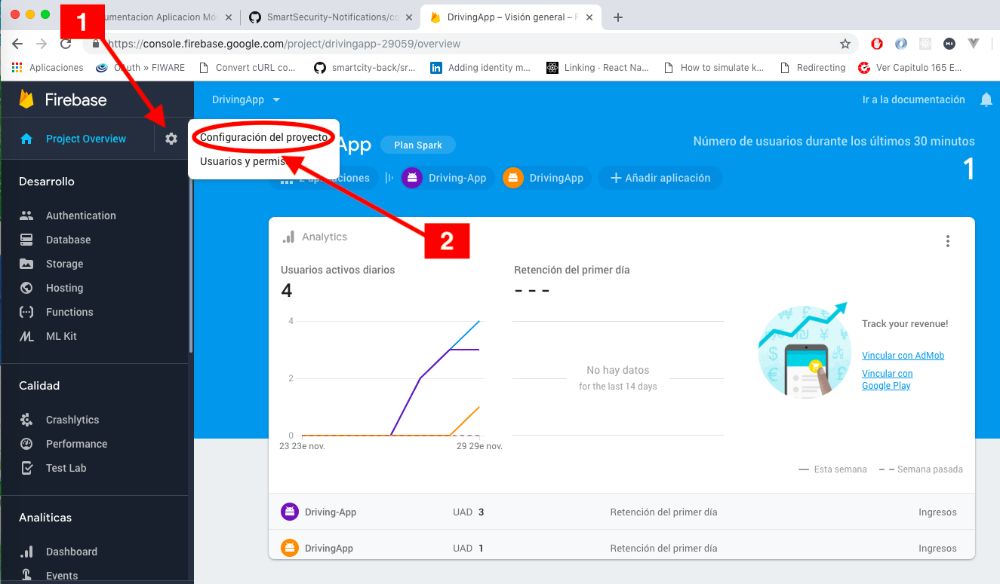
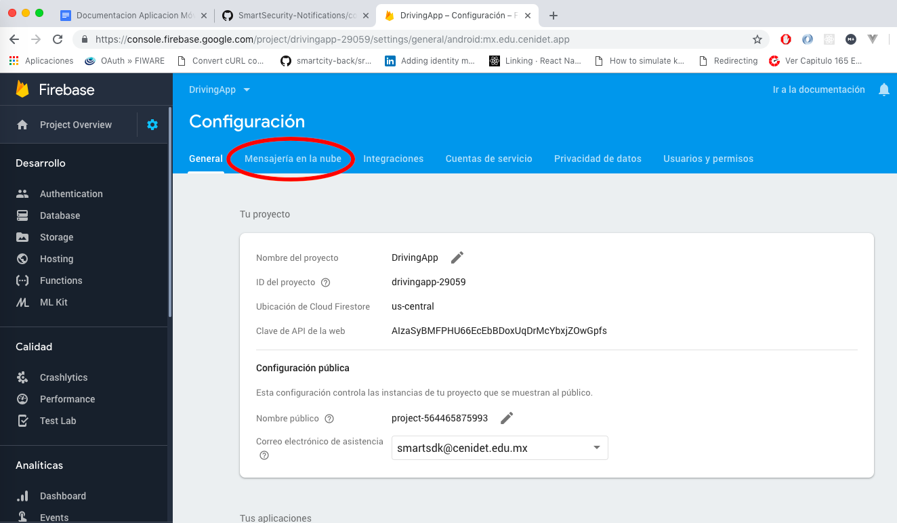
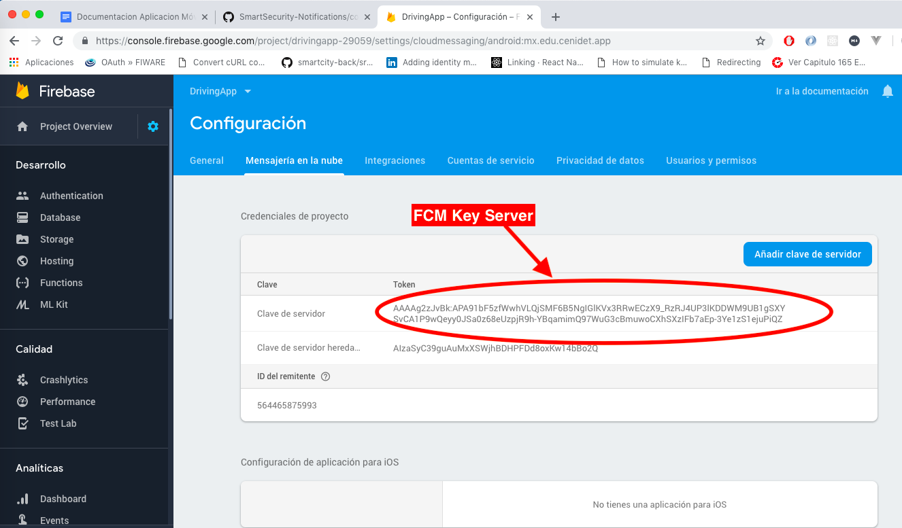

## Despliegue de Servicios Web de DrivingApp

### DrivingApp Service

#### Requerimientos generales

- **Software de Control de versiones Git**, puede consultar la documentación de Git en el siguiente [enlace]( https://git-scm.com/)
- **Entorno de ejecución Node.js**, puede consultar la documentación de instalación en el siguiente [enlace](https://nodejs.org/en/download/)
- **Gestor de paquetes npm o yarn**, puede consultar la documentación npm [aquí]( https://docs.npmjs.com/) y la documentación de yarn [aquí](https://yarnpkg.com/en/docs)
- **Sistema gestor de base de datos MariaDB** versión 10.4, consulte el siguiente [enlace](https://mariadb.org/download/) para instalar MariaDB
- **Orion ContextBroker de FIWARE** en una versión superior a la 1.15.1, puede consultar la documentación oficial en el siguiente [enlace](https://fiware-orion.readthedocs.io/en/master/) 
- **IDM - KeyRock de FIWARE** en una versión menor o igual a 6, o **Keystone de Openstack**. Puede consultar el repositorio oficial de IDM - Keyrock en el siguiente [enlace](https://github.com/ging/fiware-idm-deprecated) y la documentación de Keystone - Openstack versión 3 este [enlace] (https://docs.openstack.org/keystone/latest/)

#### Requerimientos opcionales

- Persistencia de datos por series de tiempo: 
*DrivingApp Service* proporciona la funcionalidad de obtener los datos de localización de un usuario en una zona específica. Para implementar esta funcionalidad es necesario desplegar la *API QuantumLeap de FIWARE* y configurar *DrivingApp Service* para establecer una conexión el SGBD *CrateDB*. Puedes obtener más información acerca del despliegue y utilización de la *API de QuantumLeap* en el siguiente [enlace](https://quantumleap.readthedocs.io/en/latest/)

#### Instalación

1.- Descargar el código fuente del servicio web desde su repositorio oficial en GitHub utilizando el comando: 
```sh
$ git clone https://github.com/smartsdkCenidet/DrivingApp-service.git
```

2.- Instalar los módulos npm requeridos por el servicios web, utilizando el siguiente comando dentro de la carpeta del proyecto: 
```sh
$ npm install
```

Opcionalmente, puede utilizar yarn para instalar estos mismos módulos de manera más rápida, utilizando el comando: 
```sh
$ yarn install 
```

#### Configuración

El archivo de configuración de *DrivingApp Service* es `config.js` y se encuentra dentro de la carpeta `config/` del proyecto. Debe configurar este archivo con las *URLs* de los servicios que interactúan con *DrivingApp Service*, además del usuario y contraseña utilizados en la base de datos del proyecto.

```json
exports.mysql = {
    host : 'URL', // MySQL Host
    db : 'databasename', //Database name
    user : 'databaseuser', // Database User
    password : '*******' // Database Password
  }
exports.context = "URL" // Orion URL
exports.keyrock = "URL" //KeyRock URL
exports.crate = "URL"; // CrateDB Host
```

A continuación se describen a detalle cada uno de los parámetros del archivo `config.js`:

- **exports.mysql**: Objeto JSON que contiene los parámetros para la conexión con la base de datos de *MariaDB*. Esta conexión se realiza utilizando el módulo npm llamado *Sequelize*. Los datos que utiliza *Sequelize* para realizar la conexión con la base de datos son los siguientes:
    * **host**: URL en la que se encuentra MariaDB.
    * **db**: Nombre de la base de datos con la que se establece la conexión.
    * **user**: Nombre de usuario que tiene los privilegios para LEER, EDITAR, CREAR y ELIMINAR datos en la base de datos especificada.
    * **password**: Contraseña de acceso para el nombre de usuario especificado.

La conexión entre *DrivingApp Service* y *MariaDB* se realiza por defecto a través del puerto 3306, si desea modificar configuraciones adicionales de *Sequelize* edite el archivo `DataModelsAPI/db/sequelize.js`. Para más información consulte la documentación de *Sequelize* en este [enlace](http://docs.sequelizejs.com/).

- **exports.context**: La variable **context** debe contener la URL de la instancia Orion ContextBroker utilizada. Esta URL debe incluir el protocolo HTTP o HTTPS para que *DrivingApp Service* pueda conectarse al Orion ContextBroker,además de la versión de la API NGSI utilizada. Un ejemplo de una URL de instancia Orion ContextBroker es: [http://35.185.120.11:1026/v2](http://35.185.120.11:1026/v2)

La conexión entre DrivingApp Service y el Orion ContextBroker se establece a través de la librería NGSI de JavaScript, puede consultar la documentación oficial de esta librería en este [enlace](https://ngsi-js-library.readthedocs.io/en/latest/).

- **exports.keyrock**: La variable **keyrock** hace referencia a la URL del servicio de identificación utilizado: este puede ser *IDM-Keyrock de FIWARE* o *Keystone de Openstack*. *DrivingApp Service* utiliza este servicio de identificación para autenticar a los usuarios en la aplicación móvil *DrivingApp*. Puede consultar en este [enlace]
(https://developer.openstack.org/api-ref/identity/v3/index.html) la documentación de la API Identity v3 implementada en el IDM-KeyRock y KeyStone.

Las versiones del *IDM - KeyRock* menores a las 7 utilizan el puerto 5000 con una versión de *Keystone de Openstack*. Además, el servicio Keystone de Openstack utiliza por defecto el puerto 35357. Debe considerar estos números de puertos al configurar el servicio seleccionado en *DrivingApp Service*, y evitar así confusiones entre ambos servicios.

#### Configuraciones Opcionales

- **exports.crate**: La variable **crate** especifica la URL de la base de datos de series de tiempo *CrateDB*. Por defecto *CrateDB* utiliza el puerto 4200 para realizar la conexión con la base de datos.

*DrivingApp Service* utiliza el módulo npm llamado **node-crate** para realizar la conexión con *CrateDB* y consultar los datos almacenados en la base de datos. Puede consultar la documentación de **node-crate** en el siguiente [enlace](https://www.npmjs.com/package/node-crate).

#### Despliegue de DrivingApp Service

El despliegue de DrivingApp Service puede realizarse de tres maneras: local, como demonio y con una imagen docker. A continuación se detallan cada una de estas opciones.

##### Despliegue Local

DrivingApp Service puede ser ejecutado utilizando npm o yarn como se detalla a continuación:

- Para ejecutar DrivingApService utilizando npm escriba el siguiente comando en consola, dentro de la carpeta del servicio: 
```sh
$ npm run start 
```
- Para ejecutar DrivingApService utilizando yarn escriba el siguiente comando en consola, dentro de la carpeta del servicio: 
```sh
$ yarn start
```

##### Despliegue como Demonio

DrivingApp Service puede ejecutarse además como un demonio, utilizando el módulo npm llamado **forever** como se describe a continuación:

1.- Instalar forever de forma global en el sistema con el comando: 
```sh
$ sudo npm install -g forever 
```

Así el paquete forever puede utilizarse como un comando de la terminal.

2.- Ejecutar dentro de la carpeta del servicio el archivo principal del proyecto, con el comando: 
```sh
$ sudo forever start server.js
```

Para detener *DrivingApp Service* utiliza el siguiente comando para identificar el id del proceso que le asignó forever al servicio.
```sh 
$ forever list 
```

Posteriormente utiliza el siguiente comando (seguido del id del proceso) para detener el proceso.
```sh
$ forever stop <id> 
```

##### Despliegue con Docker

##### Requerimientos

- **Docker**: Para más información acerca de Docker y su instalación consulta el siguiente [enlace](https://docs.docker.com/cs-engine/1.12/).

La imagen oficial de Docker de *DrivingApp Service* se llama **cenidetiot/drivingapp-service** y se encuentra el repositorio oficial **cenidetiot** en **DockerHub**, en el siguiente [enlace](https://hub.docker.com/r/cenidetiot/drivingapp-service/).

##### Variables de entorno

Las variables de entorno de la imagen Docker de DrivingApp Service se reemplazan con los datos de los servicios y de los SGBD utilizados por DrivingApp Service.
Las variables que inician con **MYSQL_** hacen referencia a la variable mysql del archivo `config.js`.

- **MYSQL_HOST**: URL en el que está instalado el SGBD MariaDB.
- **MYSQL_DB**: Nombre de la base de datos.
- **MYSQL_USER**: Nombre de usuario que tiene los privilegios de LEER, EDITAR, CREAR y ELIMINAR datos en la base de datos especificada.
- **MYSQL_PASSWORD**: Contraseña de acceso del nombre de usuario especificado.
- **ORION**: Hace referencia a la variable context del archivo `config.js`.
- **KEYROCK**: Hace referencia a la variable keyrock del archivo `config.js`.
- **CRATEDB**: Hace referencia a la variable crate del archivo `config.js`.

##### Ejecución

La imagen Docker de DrivingApp Service se ejecuta por defecto el  puerto 4005, el comando utilizado para ejecutar la imagen es el siguiente: 
```sh
$ docker run -p 4005:4005 --env="MYSQL_HOST=<MYSQL_HOST>" --env="MYSQL_DB=<MYSQL_DB_NAME>" \ --env="MYSQL_USER=<MYSQL_AUTORIZED_USER>" --env="MYSQL_PASSWORD=<MYSQL_PASSWORD>" \  --env="CRATEDB=<CRATEDB_HOST>" --env="ORION=<ORION_CONTEXT_BROKER_URL>"  \ cenidetiot/drivingapp-service
```

### Notifications Service

#### Requerimientos

- **Software de Control de versiones Git**, puede consultar la documentación de Git en el siguiente [enlace](https://git-scm.com/)
- **Python** versión 2.7.X, para instalar Python en su sistema operativo consulte el siguiente [enlace](https://www.python.org/downloads/release/python-2715/)
- Manejador de paquetes pip para Python, para instalar este paquete consulta el siguiente [enlace]( https://pip.pypa.io/en/stable/installing/)
- Servicio web DrivingApp Service, consulta el repositorio oficial de este servicio en el siguiente [enlace](https://github.com/smartsdkCenidet/smartsecurity-web-service.)

#### Instalación 

1. Descargar el código de Notifications Service desde el repositorio oficial con el comando: 
```sh
$ git clone https://github.com/smartsdkCenidet/Notifications-service.git
```
2. Instalar los requerimientos del servicio con el comando: 
```sh
$ pip install -r requirements.txt
```

#### Configuración 

El archivo de configuración de Notifications Service es config.py. Este archivo está en la carpeta raíz del proyecto y contiene los parámetros de configuración necesarios para que el proyecto funcione. El archivo config.py especifica los siguientes parámetros: 

    smart = "https://smartsecurity-webservice.herokuapp.com"
    fcm = "*******"
    username = 'daniel'
    password = "sm2"

- **smart**: El atributo smart contiene la URL de DrivingApp Service. El servicio Notifications Service utiliza DrvingApp Service para consumir los datos de zonas y dispositivos registrados. Recuerde que DrivingApp Service utiliza por defecto el puerto 4005.
- **fcm**: El atributo fcm contiene el código de la aplicación configurada en Firebase en esta [sección](../userManual/configurations#configuracion-fcm). Para  obtener el código de un proyecto Firebase siga los pasos siguientes.

1.- Dentro de la consola del proyecto en Firebase, seleccione el símbolo del engrane en la sección **Project Overview** y  en el menú emergente de click en **Configuración del Proyecto**.


2.- Ingrese a la sección de **Mensajería en la nube**.


3.- Copie la clave del servidor y agregue esta clave a la variable fcm del archivo config.py 


#### Configuración Opcional

Atributos **username** y **password**: Estos atributos son utilizados para suscribir una aplicación web a las notificaciones del servicio Notifications Service. Para recibir las notificaciones de alertas en una aplicación web, configure estos parámetros por medio de web sockets.

#### Creación de Suscripción de Alertas en el Orion ContextBroker

El *Orion ContextBroker* utiliza suscripciones para notificar a aplicaciones o servicios de terceros cambios en las entidades de contexto. Notifications Service se suscribe al Orion ContextBroker para recibir notificaciones sobre cambios en las entidades de alerta, o la creación de nuevas entidades de alerta. Para conocer más acerca de la creación y administración de Suscripciones NGSIv2 en el Orion ContextBroker, consulte el siguiente [enlace](https://fiware-orion.readthedocs.io/en/master/user/walkthrough_apiv2/index.html#subscriptions) 
La suscripción de *Notifications Service* al Orion ContextBroker tiene como objetivo obtener los datos de las entidades de tipo **Alert** que sean actualizadas o creadas. *Notifications Service* recibe los datos de la entidad de alerta en formato `KeyValues`, para más información acerca de este formato consulte este [enlace]( http://fiware.github.io/specifications/ngsiv2/stable/), en la sección **Subscriptions** atributo **attrsFormat**

Ejemplo de la suscripción de Alerta para Notifications Service.

```json
{
    "description": "Alert subscription",
    "subject": {
     "entities": [
        {	
          "idPattern": ".*", 
 "type": "Alert" 
        }
      ],
      "condition": {
        "attrs": [
          "id",
          "type",
          "category",
          "subCategory",
          "location",
          "dateObserved",
          "description",
          "alertSource",
          "data",
          "severity"
        ]
      }
    },
    "notification": {
      "http": {
        "url": "http://10.0.0.7:8001/notify"
      },
      "attrs": [
        "id",
          "type",
          "category",
          "subCategory",
          "location",
          "dateObserved",
          "description",
          "alertSource",
          "data",
          "severity"
      ],
      "attrsFormat":"keyValues"
    },
    "expires": "2040-01-01T14:00:00.00Z",
    "throttling": 5
}
```

Entre los atributos destacables de esta subscripción se encuentran: 

- **entities**: Este atributo tiene como valor un array que especifica mediante los atributos id y type, las entidades que estarán suscritas a la aplicación o servicio. Se puede utilizar una suscripción para más de un tipo de entidad. En la suscripción de ejemplo se especifica que las entidades suscritas a Notifications Service son todas las entidades con **type: Alert**. Los atributos de las entidades de alerta deben cumplir con el modelo de datos **Alert** de FIWARE. Para conocer la especificación oficial de este modelo, consulta este [enlace](https://github.com/Fiware/dataModels/tree/master/specs/Alert)

Para suscribir Notifications Service a las alertas de la aplicación móvil DrivingApp, el atributo entities debe contener el atributo idPattern con la siguiente expresión regular: **"Alert:Device_Smartphone_.*"**.Así, el Orion ContextBroker enviará las Alertas que inicien con el texto **"Alert:Device_Smartphone_"** en el atributo **id**

- **notification**: Este atributo tiene como valor la URL a la que se enviarán los datos de las alertas que sean creadas o actualizadas. Notifications Service utiliza la ruta **/notify** para recibir las notificaciones de alertas enviadas por el Orion ContextBroker.

- **attrsFormat**: En la suscripción de alertas, este atributo debe tener el valor `keyValues`, para que Notifications Service pueda interpretar los datos de alerta enviados por el Orion ContextBroker.

#### Despliegue

El despliegue de Notifications Service puede realizarse de dos maneras: local y con una imagen 
docker. A continuación se detallan cada una de estas opciones.

##### Despliegue Local

- Utilizando Python

Para ejecutar NotificationsService con Python utilice el siguiente comando que  ejecuta el archivo principal del proyecto:  
```sh
$ python run.py
```

- Utilizando Flask

Para ejecutar NotificationsService con Flask realice los pasos siguientes:
1.- Exporte como variable de entorno el nombre del archivo principal del proyecto,  con el comando: 
```sh
$ export FLASK_APP=run.py 
```
Puede consultar la documentación oficial de Flask en el siguiente [enlace](http://flask.pocoo.org/) 

2.- Ejecutar el servicio utilizando el siguiente comando: 
```sh
$ flask run
```

- Utilizando Gunicorn

Ejecuta el siguiente comando: 
```sh
$ gunicorn app:app 
```
Puede consultar la documentación oficial de gunicorn en el siguiente [enlace](https://gunicorn.org/#docs)

##### Despliegue con Docker

##### Requerimientos 

- **Docker**: Para más información acerca de Docker y su instalación consulta el siguiente [enlace](https://docs.docker.com/cs-engine/1.12/).

La imagen oficial Notifications Service se llama **cenidetiot/notifications-service** y se encuentra el repositorio oficial **cenidetiot** en **DockerHub**, en el siguiente [enlace]( https://hub.docker.com/r/cenidetiot/notifications-service/)

##### Variables de entorno

Las variables de entorno de la imagen Docker de NotificationsService  se reemplazan con los datos de la configuración del servicio. 

- **SMART_SERVICE**: Hace referencia a la variable smart del archivo `config.py`.
- **FCM_SERVER_TOKEN**: Hace referencia a la variable fcm del archivo `config.py`.
- **PASSWORD**: Hace referencia a la variable password del archivo `config.py`.
- **USER_NAME**: Hace referencia a la variable username del archivo `config.py`.

##### Ejecución

La imagen Docker de NotificationsService utiliza por defecto el puerto 3001, el comando utilizado para ejecutar la imagen es el siguiente: 

```sh
$ docker run -ti --env="SMART_SERVICE=<DRIVINGAPP_SERVICE>" \ --env="FCM_SERVER_TOKEN=<FCM_SERVER_TOKEN>" --env="PASSWORD=<USER_PASSWORD>" \ --env="USER_NAME=<USER_NAME>" -p 3001:3001 cenidetiot/notifications-service
```
