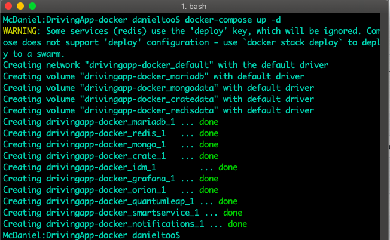

## Despliegue del sistema con Docker Compose

Docker Compose es una herramienta para definir y ejecutar aplicaciones Docker de múltiples contenedores. El sistema de DrivingApp puede desplegarse a través de esta herramienta. La siguiente tabla muestra la estructura del sistema utilizando contenedores Docker.

|Docker Image|Version|Container name|Ports|Depends on|
|---------|-----------|----------|----------|-----------|
|fiware/orion|1.15.1|orion|1026|mongo|
|mongo|3.2|mongo|27017|
|smartsdk/quantumleap|latest|quantumleap|8668|orion, mongo, crate|
|crate|3.0.5|crate|4200, 4300|
|grafana/grafana|latest|grafana|3000|crate
|redis|latest|redis|6379|
|mariadb|latest|mariadb|3306|
|cenidetiot/drivingapp-service|latest|drivingappservice|4005|mariadb, crate, orion, idm|
|cenidetiot/notifications-service|latest|notifications|3001|smartservice|
|ging/fiware-idm|latest|idm|5000|

### Requerimientos

- **Software de control de versiones Git**, puedes consultar la documentación de Git en este [enlace]( https://git-scm.com/).
- **Docker**: Puede consultar la instalación de Docker en el siguiente [enlace](https://docs.docker.com/cs-engine/1.12/).
- **Docker Compose**: Puede consultar la instalación de docker-compose en  el siguiente [enlace](https://docs.docker.com/compose/install/).

### Ejecución 

1.- Descargar los archivos del repositorio oficial de DrivingApp-docker:
```sh
$ git clone https://github.com/smartsdkCenidet/DrivingApp-docker.git
```

2.-Ejecutar el archivo docker-compose.yml utilizando el comando: 
```sh
$ docker-compose up -d 
```

**docker-compose** descarga y ejecuta automáticamente las imágenes docker y los contenedores de cada imagen, este proceso puede tardar algunos minutos.mLa siguiente imagen muestra este proceso en consola:



3.- Verificar que todos los contenedores están ejecutándose con el comando:
```sh
$ docker ps 
```


