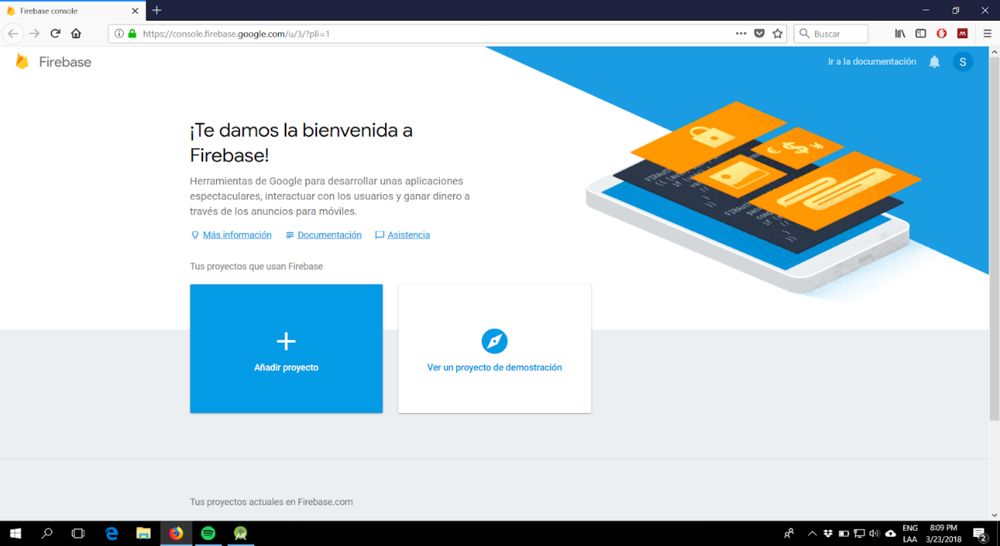
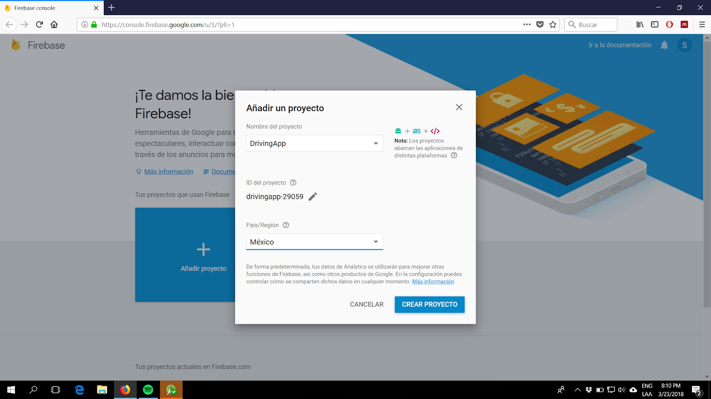
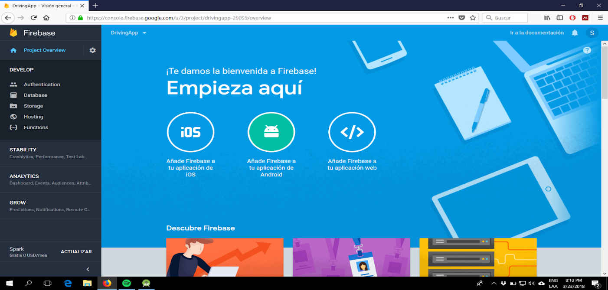
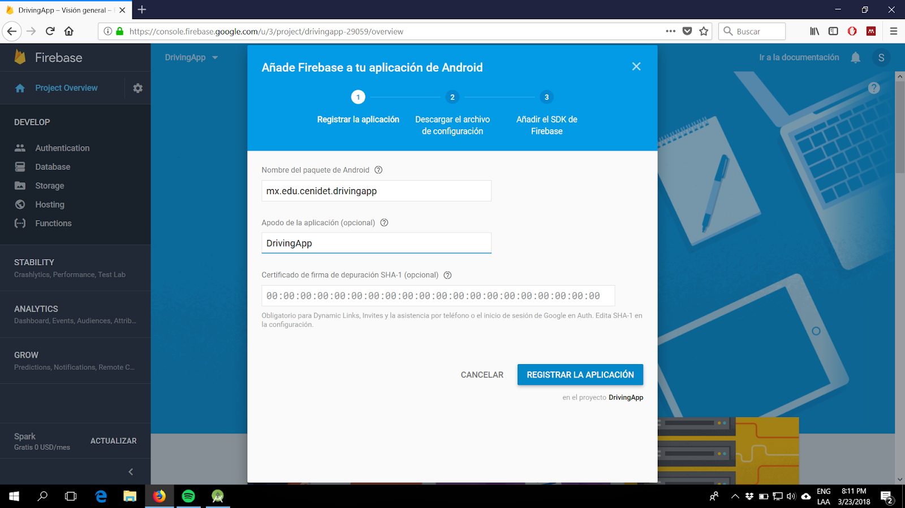
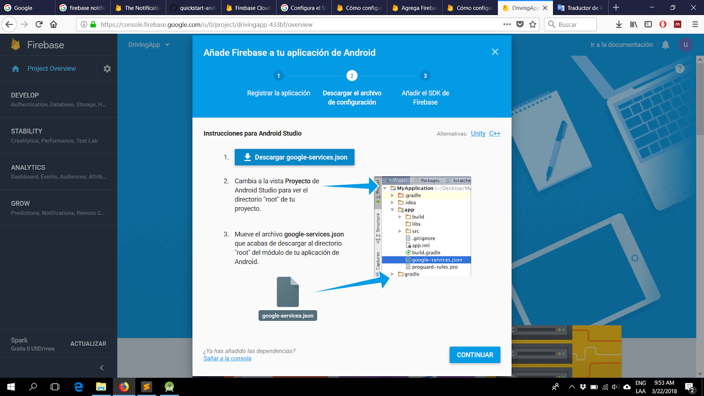
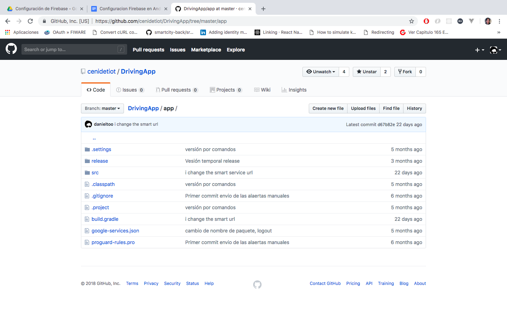
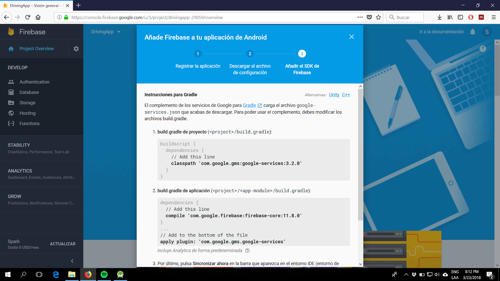
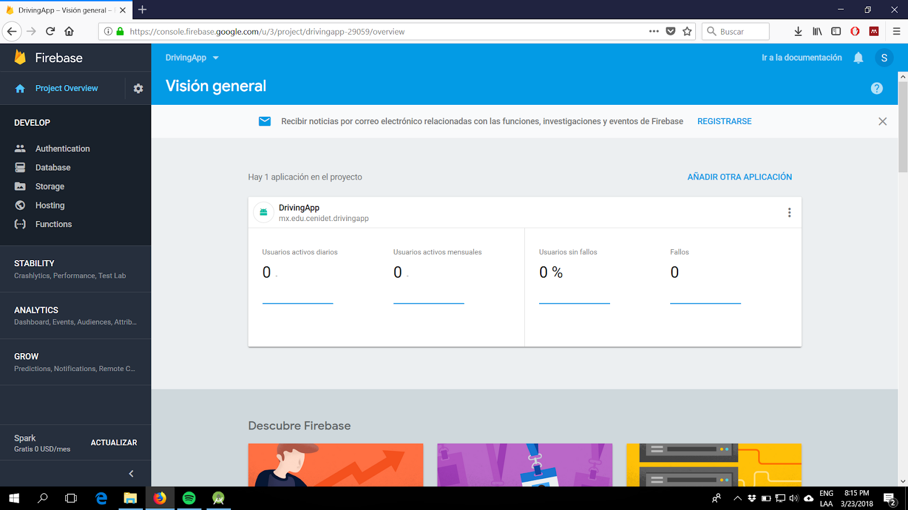

## General DrivingApp Configurations

DrivingApp uses external services to consume the information that shows the user in the application. The Orion ContextBroker of FIWARE is one of these external services, this component manages the context information produced by the application. Other services that DrivingApp uses are web services, these have the function of manipulating data entities and queries of the mobile application; In addition, these web services allow the mobile application to manage the information of the notifications received by the application.  
The DrivingApp project contains configuration files to modify the URLs of the services used by the application. To modify these files, follow the steps below.

#### 1.- Download the DrivingApp project

You can consult the DrivingApp project in this [repository] (https://github.com/cenidetiot/DrivingApp.git) of Github. If you want to download the project through the git version control software, run the following console command:

```sh
git clone https://github.com/cenidetiot/DrivingApp.git.  
```

In addition, Github also provides the option to download a project in a .zip file.

#### 2.- Open the DrivingApp project in Android Studio

Once you have downloaded the DrivingApp project, open it with the Android Studio development environment. For more information about downloading and configuring Android Studio visit the following [link](https://developer.android.com/studio/)

**NOTE**: The Android SDK number 23 is configured as the minimum version of the DrivingApp project.

#### 3.- Configure the services of the DrivingApp application

Open the DrivingApp project in Android Studio and configure the following:

##### 3.1 Configure the connection with an Orion ContextBroker instance

The `config.properties` file of the DrivingApp project is located in the path: ngsi/src/main/assets/, and contains the configuration properties for the connection to an Orion ContetxBroker instance. This file defines the properties: `host`,` port` and `apiversion`, which specify the following:

El archivo `config.properties` del proyecto DrivingApp está ubicado en la ruta: ngsi/src/main/assets/, y contiene las propiedades de configuración para la conexión con una instancia Orion ContetxBroker. Este archivo define las propiedades: `host`, `port` y `apiversion`, las cuales especifican lo siguiente:

- La propiedad `host` define la url ó IP de la instancia del Orion ContextBroker.
- La propiedad `port` especifica el puerto de la instancia Orion ContextBroker definida.
- La propiedad `apiversion` define la versión de la API con la que son definidas las solicitudes al Orion ContextBroker.

Un ejemplo de la configuración del archivo `config.properties` es la siguiente:

```java
http.host = http://130.206.113.226 // Change it for your Orion host 
http.port = 1026 // Change it form your Orion port
http.apiversion = v2 // Change if for your Orion api version
```

##### 3.2	Configurar DrivingAppService

DrivingApp utiliza DrivingAppService para manipular las entidades públicas del proyecto,basadas en modelos de datos FIWARE; además de las entidades privadas creadas para este proyecto. DrivingAppService proporciona una API RESTFul para la administración de estas entidades públicas y privadas que utiliza la aplicación móvil DrivingApp. Además, DrivingApp también utiliza el servicio DrivingAppService para realizar consultas de contexto y gestionar la información de las alertas. Puede consultar el código fuente de este servicio web en este [enlace](https://github.com/cenidetiot/smartsecurity-web-service)

Para configurar DrivingAppService en el proyecto DrivingApp debe modificar el archivo `ConfigServer.java`, con configurar la URL de DrivingAppService. Este archivo está en la ruta: cenidetsdk/src/main/java/mx/edu/cenidet/cenidetsdk/utilities/ del proyecto DrivingApp. 

Un ejemplo de la configuración de este archivo es el siguiente:

```java
http_host("https://smartsecurity-webservice.herokuapp.com")
```

##### [3.3 Configuración del proyecto Firebase Cloud Messaging (FCM) para la aplicación DrivingApp](#configuracion-fcm)

Firebase Cloud Messaging (FCM) es una solución multiplataforma en la nube para envío de mensajes y notificaciones a dispositivos Android, iOS y aplicaciones web. Este servicio es proporcionado por Firebase y actualmente se puede utilizar sin costo alguno.
La aplicación DrivingApp utiliza los servicios de FCM para replicar las notificaciones de alertas a los dispositivos de los usuarios. Los algoritmos de la aplicación para el envío de alertas pueden utilizarse para replicar y recibir notificaciones de alertas, sin realizar modificaciones adicionales al código. Por otro lado, para implementar notificaciones de alertas personalizadas en DrivingApp ó en otra aplicación, realice las instrucciones que se presentan a continuación para configurar los servicios de FCM en la aplicación móvil:

1.- Acceda al sitio de Firebase en este [enlace](https://console.firebase.google.com/) y seleccione la opción de *Añadir Proyecto*.



2.- Agregue un nombre de proyecto y seleccione el país o región. El nombre de proyecto puede ser DrivingApp o el nombre de la aplicación que esté desarrollando. Firebase agrega un número de serie al nombre del proyecto que lo identifica entre otros proyectos con nombre similar. Cuando haya completado esta información, de click en el botón **Crear Proyecto**.



3.- Firebase crea el proyecto y abre la vista de la consola con el menú de funciones. En esta vista debe seleccionar la opción *Añade Firebase a tu aplicación móvil de Android* para comenzar con la configuración de Firebase en su aplicación Android, como muestra la siguiente imagen.



4.-	Registre su aplicación agregando el nombre del paquete de la aplicación Android. Si desea configurar DrivingApp nuevamente, el nombre de paquete es `mx.edu.cenidet.drivingapp`; en cambio, si es una aplicación propia, agregue el nombre del paquete correspondiente. Cuando haya completado esta información, de click en el botón **Registrar Aplicación**.



5.- Descargue el archivo de configuración `google-services.json` y muévalo a la carpeta principal del proyecto para añadir Firebase a su aplicación móvil Android. En el proyecto DrivingApp, este archivo de configuración está en la carpeta principal, debe reemplazarlo si desea configurar el proyecto nuevamente. Posteriormente de click en el botón **Continuar**.





6.- Modifique el archivo `build.gradle` del proyecto y el archivo `build.gradle` de la aplicación como se muestra en la imagen para utilizar el complemento de los servicios de Google para Gradle. Esta configuración ya se ha realizado en el proyecto DrivingApp, sin embargo, si está creando un nuevo proyecto a partir del código de DrivingApp debe modificar los archivos como se indica.



7.- Finalmente, Firebase le muestra las estadísticas de los usuarios que utilizan la aplicación Android configurada.

