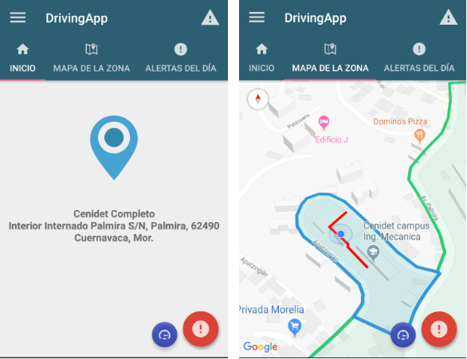
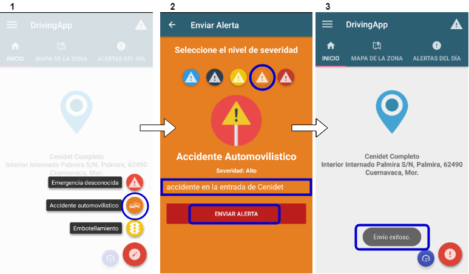
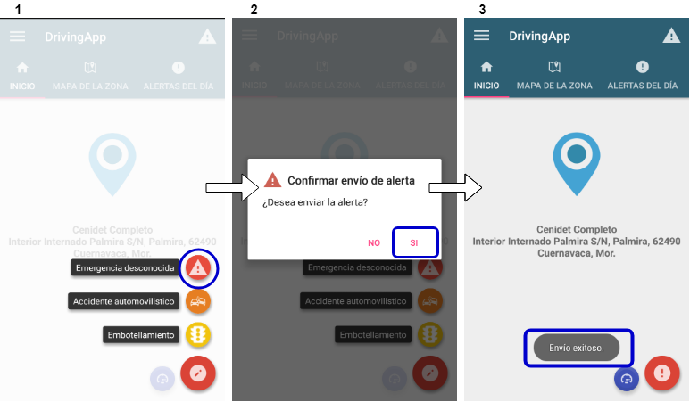
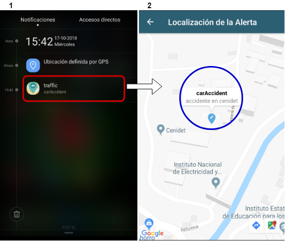
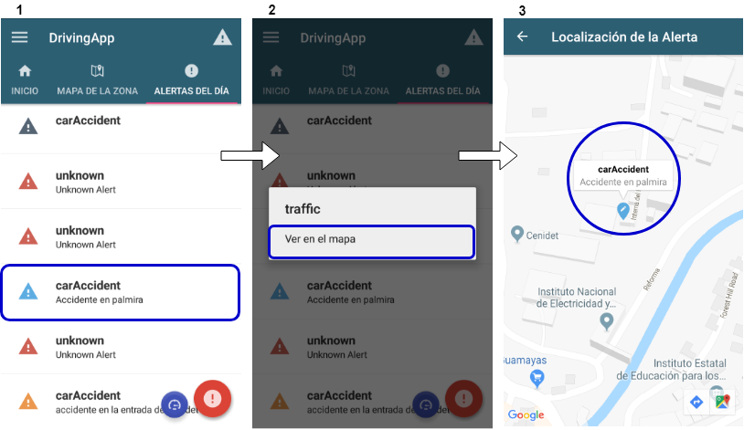
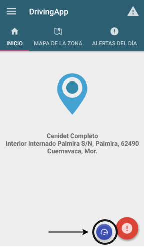
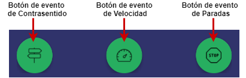
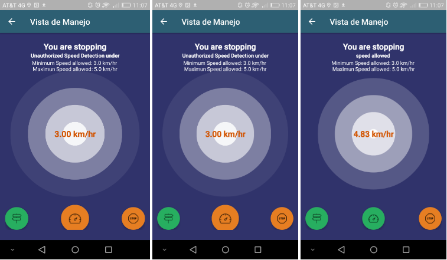
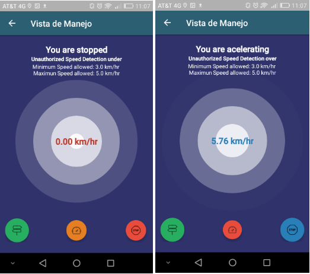

## Funcionalidades de DrivingApp

### Identificación de la ubicación del usuario

DrivingApp identifica la ubicación del usuario cuando se encuentra dentro del área de una zona delimitada. Esta zona debe ser registrada por el administrador o guardia de seguridad del sistema, a través de la interfaz de ViVA. 
Cuando el usuario inicia sesión en DrivingApp, la vista de Inicio de la aplicación muestra la zona en la que se encuentra el usuario, el nombre y dirección de la misma. Además, la vista del mapa de zona muestra la delimitación de la zona, sus estacionamientos y la ubicación actual del dispositivo dentro de dicha zona. Las siguientes imágenes muestran un ejemplo de estas vistas:

### Generación manual de alertas.

DrivingApp permite a los usuarios generar alertas manuales de tráfico, seguridad y accidentes automovilísticos. Estas alertas pueden ser de 3 tipos: embotellamiento, accidente automovilístico y emergencia desconocida. Cada una de estas alertas puede ser enviada con un nivel de severidad de acuerdo con la gravedad del evento observado por el usuario. Los niveles de severidad de cada alerta pueden ser: informacional, bajo, medio, alto o crítico. Las alertas de eventos de emergencia desconocida se envían siempre con el nivel de severidad crítico, debido a que se desconoce el tipo de evento ocurrido. 

Para generar un alerta manual de tráfico, siga los pasos siguientes:

1. Presionar el botón flotante de alertas en la pantalla de Inicio de la aplicación y seleccionar el tipo de alerta a generar presionando el botón flotante de embotellamiento o accidente automovilístico.
2. Seleccionar el nivel de severidad de la alerta presionando el botón con el ícono del color correspondiente y escriba una descripción que identifique al evento de alerta. Posteriormente, presionar en el botón de Enviar Alerta.
3. La aplicación le informará del envío exitoso de la alerta mediante un mensaje.

Para generar una alerta de emergencia desconocida, siga los pasos siguientes: 

1. Presionar el botón flotante de alertas en la pantalla de Inicio de la aplicación y seleccionar la opción: emergencia desconocida.
2. Confirmar el envío de la alerta presionando la opción SI.
3. La aplicación le informará del envío exitoso de la alerta mediante un mensaje.

### Notificaciones de alertas y su visualización en el mapa.

Las alertas que emiten los usuarios a través de DrivingApp, son replicadas en forma de notificaciones a los dispositivos móviles de los demás usuarios. Estas notificaciones de alertas muestran la categoría y subcategoría del evento de alerta. El usuario puede abrir las notificaciones de alertas para visualizar la localización de cada alerta en el mapa. Las siguientes imágenes muestran un ejemplo de la notificación de una alerta: 

1. Una notificación de alerta llega al dispositivo móvil y se ubica en la barra de notificaciones. Esta notificación muestra la categoría y la subcategoría del evento de alerta.
2. El usuario presiona la notificación y la aplicación muestra la localización de la alerta en el mapa.

### Listado de alertas y su visualización en el mapa.

Las alertas enviadas por los usuarios son agrupadas en listado de alertas de DrivingApp, cada alerta del listado muestra la subcategoría y descripción de la alerta. Para visualizar la localización de una alerta del listado, siga los pasos que se enumeran a continuación:

1. Mantener presionada la alerta que desea ubicar en el mapa. 
2. Oprimir la opción ver en el mapa para observar la ubicación de la alerta en el mapa.
3. La aplicación muestra la ubicación de la alerta en el mapa, mediante un marcador que muestra la subcategoría y descripción del evento.

### Vista de manejo para conducción de vehículo.

Para los usuarios conductores, DrivingApp es útil para detectar de manera automática eventos de conducción incorrecta de vehículos dentro de una zona delimitada. Los eventos que DrivingApp puede identificar son: conducción a una velocidad no autorizada, conducción en sentido contrario y paradas repentinas de un vehículo.  El usuario que conduce un vehículo dentro de una zona delimitada, puede activar el modo de conducción en la aplicación. La siguiente imagen muestra la vista de Inicio de DrivingApp, señalando el botón para activar el modo de manejo de vehículo.

La vista de manejo muestra la velocidad del vehículo en km/hr, y el límite máximo y mínimo de velocidad permitida en la calle de la zona. Además, esta vista muestra mensajes al usuario como:

- Estás manejando de forma correcta.
- Te estás deteniendo.
- Estás detenido.
- Estás acelerando.

El usuario que conduce un automóvil, puede identificar de manera automática a través de la vista de manejo un evento de conducción incorrecta. Los botones de la vista de manejo se iluminan de acuerdo al ascenso o descenso de velocidad del vehículo. La siguiente imagen muestra los botones de cada evento en la vista de manejo de DrivingApp.

Las alertas en la conducción de un vehículo se representan mediante los siguientes colores:

1.- Botón de evento de velocidad: 

- Color Naranja: indica que la velocidad del vehículo está por debajo del límite mínimo permitido.
- Color Rojo: indica que el vehículo ha excedido el límite de velocidad máximo permitido.
- Color Verde: indica que está conduciendo dentro del rango de límite de velocidad permitida. 

2.- Botón de evento de paradas:

- Color azul: indica que el vehículo se encuentra acelerando.
- Color Naranja: significa que el vehículo disminuye su velocidad.
- Color Rojo: indica que el vehículo se ha detenido.
- Color verde: significa que está conduciendo de forma correcta.

3.- Botón de evento de contrasentido:

- Color verde: indica que el usuario está conduciendo el vehículo en el sentido correcto de la calle.
- Color rojo: indica que el usuario está conduciendo el vehículo en el sentido incorrecto de la calle.

Las siguientes imágenes muestran ejemplos de la vista de manejo, donde se detectan diferentes eventos mediante la iluminación de cada uno de los botones.

