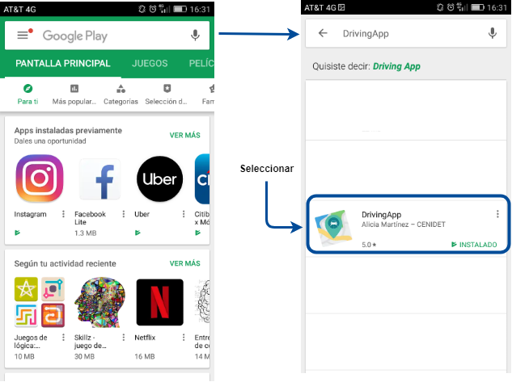
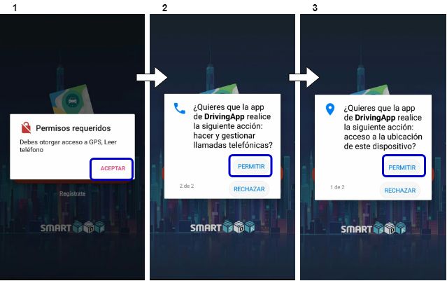
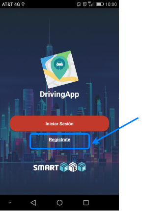
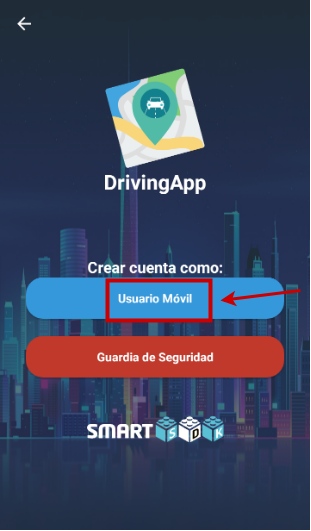
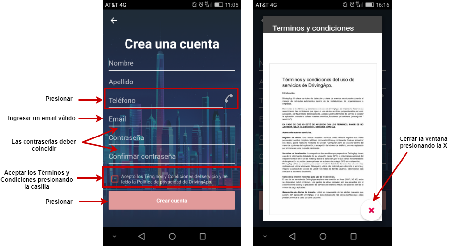
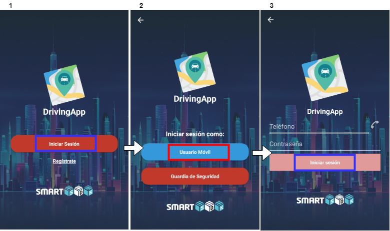

# DrivingApp

## Instalación y ejecución de DrivingApp
La aplicación móvil DrivingApp está disponible en Google Play Store con el nombre DrivingApp,desarrollada por Alicia Martínez – CENIDET. [Aquí](https://play.google.com/store/apps/details?id=mx.edu.cenidet.app) podrá encontrar el enlace de descarga de la aplicación o puede buscarla en Google Play Store, como muestra la siguiente imagen:

Para instalar la aplicación DrivingApp siga los pasos que se muestran en las siguientes imágenes. 

DrivingApp solicita que acepte los permisos de ubicación GPS y uso de número su de telefónico al abrir la aplicación por primera vez. Es importante aceptar estos permisos para que pueda utilizar las funcionalidades que ofrece la aplicación DrivingApp. Las siguiente imágen muestran los permisos que solicita la aplicación:

## Registro de cuenta de usuario e inicio de sesión

El primer paso para utilizar DrivingApp es registrar una cuenta de usuario. Esta cuenta de usuario debe ser generada como una cuenta de tipo *usuario móvil* o *guardia de seguridad*. 

### Cuenta de usuario móvil

Para crear una cuenta de usuario móvil, abra la aplicación y siga los pasos que se muestran en las siguientes imágenes:

1. Presionar el enlace de *Regístrate*.

2. Presionar el botón de cuenta *Usuario Móvil*.

3. Completar las entradas de texto con sus datos personales, cuando haya completado la información, acepte los Términos y Condiciones y presione el botón *Crear Cuenta*. Si la cuenta se ha generado de forma exitosa, la aplicación le mostrará el mensaje: *Cuenta generada exitosamente*. 

4. Por último, inicie sesión en la aplicación móvil con la cuenta que ha creado anteriormente, como se muestra en las siguientes imágenes. Diríjase a la vista principal y presione el botón de *Iniciar Sesión*. En la vista siguiente presione el botón de *Usuario Móvil*, este botón lo redirigirá a la vista de inicio de sesión, en donde debe ingresar el número telefónico y contraseña que utilizó para crear su cuenta de *usuario móvil*.  

