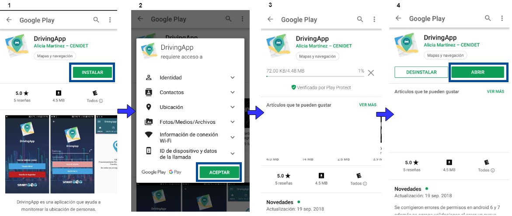

## Instalación y ejecución de DrivingApp

La aplicación móvil está disponible en Google Play Store con el nombre DrivingApp, desarrollada por Alicia Martínez – CENIDET. [Aquí](https://play.google.com/store/apps/details?id=mx.edu.cenidet.app) podrá encontrar el enlace de descarga de la aplicación, o puede buscarla en Google Play Store como muestra la siguiente imagen:

Para instalar la aplicación DrivingApp siga los pasos que se muestran en las siguientes imágenes. 

DrivingApp le solicita que acepte los permisos de ubicación GPS y uso de número su de telefónico al abrir la aplicación por primera vez. Es importante aceptar estos permisos para que pueda utilizar las funcionalidades que ofrece la aplicación. Las siguientes imágenes muestran estos permisos:

## Registro de cuenta de usuario e inicio de sesión

Para comenzar a utilizar DrivingApp, el primer paso es registrar una cuenta de usuario. Esta cuenta de usuario debe ser generada como una cuenta de tipo *usuario móvil* o *guardia de seguridad*.

### Cuenta de usuario móvil

Para crear una cuenta de usuario móvil e iniciar sesión, abra la aplicación DrivingApp y siga los pasos que se muestran en las siguientes imágenes:

1.- Presionar el enlace de *Regístrate*.

2.- Presionar el botón de cuenta *Usuario Móvil*.

3.- Completar las entradas de texto con sus datos personales y, cuando haya completado la información, acepte los Términos y Condiciones y presione el botón *Crear Cuenta*. Si la cuenta se ha generado de forma exitosa, la aplicación le mostrará el mensaje: *Cuenta generada exitosamente*. 

4.- Por último, inicie sesión en la aplicación móvil con la cuenta que ha creado anteriormente,como se muestra en las siguientes imágenes. Diríjase a la vista principal y presione el botón *Iniciar Sesión*. En la vista siguiente presione el botón *Usuario Móvil*, este botón lo redirigirá a la vista de inicio de sesión, en donde debe ingresar el número telefónico y contraseña que utilizó para crear su cuenta de *usuario móvil*.  

### Cuenta de guardia de seguridad

DrivingApp también permite a los usuarios el inicio de sesión con cuenta de tipo guardia de seguridad. Sin embargo, las cuentas de usuario de guardia de seguridad no pueden crearse desde la aplicación móvil. Para crear una cuenta de este tipo, usted debe acceder a la [aplicación web ViVA](https://viva-smartsdk.duckdns.org ) y registrarse. Cuando se haya registrado debe esperar a que el administrador de ViVA active su cuenta de usuario para que pueda iniciar sesión en DrivingApp. 
Para realizar su registro en ViVA e iniciar sesión en DrivingApp, abra la aplicación y siga los pasos que se muestran a continuación.

1.- Presionar el enlace de *Regístrate*.

2.- Presionar el botón de cuenta de *Guardia de Seguridad*.

3.- Registrar sus datos en ViVA, cuando complete su registro presione el botón de regresar.

4.-	Por último, inicie sesión en la aplicación móvil con la cuenta de usuario creada anteriormente, como se muestra en las siguientes imágenes. Diríjase a la vista principal de la aplicación DrivingApp y presione el botón *Guardia de seguridad*. En la vista siguiente ingrese el email y contraseña que utilizó para realizar su registro en ViVA, cuando haya completado esta información presione el botón *Iniciar Sesión*. 

### Habilitar GPS del dispositivo móvil

DrivingApp le solicitará que habilite del sensor GPS en su dispositivo móvil, esto en caso de que el sensor no se esté habilitado al momento de iniciar sesión en la aplicación, como muestra la siguiente imagen:

Cuando habilite los servicios de ubicación GPS, presione el botón atrás de su teléfono móvil para regresar a la vista de Inicio de la aplicación.

