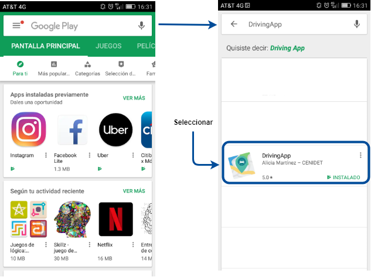
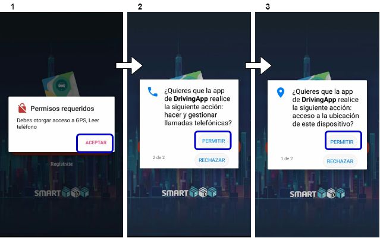
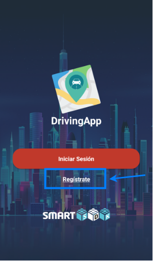
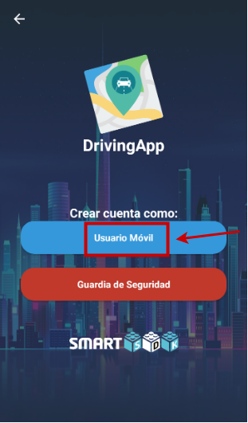
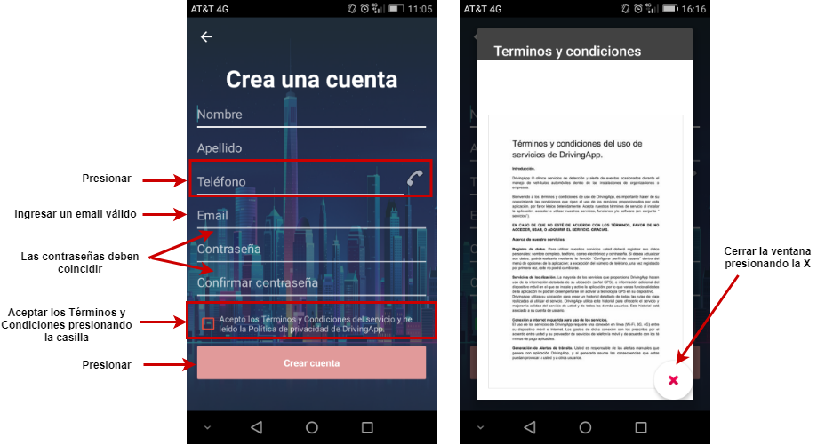
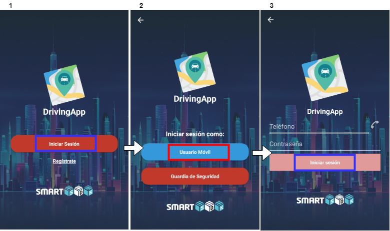
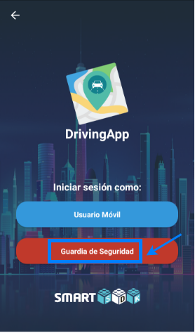
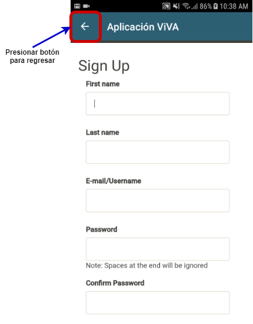
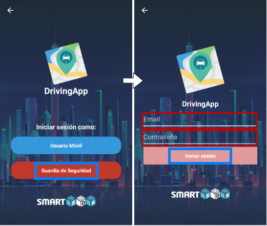
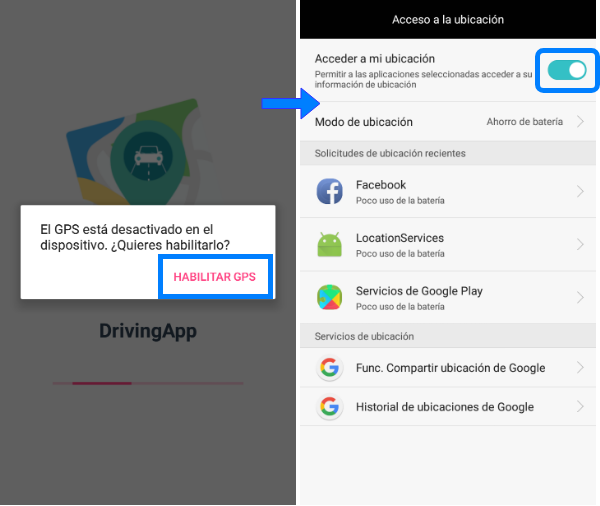

## Installation and execution of DrivingApp

The mobile application is available in the Google Play Store with the name DrivingApp, developed by Alicia Martínez - CENIDET. [Here](https://play.google.com/store/apps/details?id=mx.edu.cenidet.app) you can find the download link for the application, or you can search it in the Google Play Store as shown next image:

To install the DrivingApp application follow the steps shown in the next images.

DrivingApp asks you to accept GPS location permits and phone number usage when opening the application for the first time. It is important to accept these permissions for you can use the features offered by the application. The following images show these permissions:

## User account registration and login

To start using DrivingApp, the first step is to register a user account. This user account must be generated as a type *mobile user* or *security guard* account.

### Mobile user account

To create a mobile user account and log in, open the DrivingApp application and follow the steps shown in the next images:

1.- Press the link of *Register*.

2.- Press the account button *Mobile User*.

3.- Complete the text inputs with your personal data and, when you have completed the information, accept the Terms and Conditions and press the button *Create Account*. If the account has been generated successfully, the application will show you the message: *Account generated successfully*.

4.- Finally, log in to the mobile application with the account you created previously, as shown in the following images. Go to the main view and press the *Start Session* button. In the next view press the button *Mobile User*, this button will redirect you to the login view, where you must enter the phone number and password used to create your *mobile user* account.

### Security guard account

DrivingApp also allows users to log in with a security guard type account. However, security guard user accounts can not be created from the mobile application. To create an account of this type, you must access to the [ViVA web application](https://viva-smartsdk.duckdns.org) and register you. When you have registered, you must wait for the ViVA administrator to activate your user account so you can log in to DrivingApp.
To register in ViVA and log in to DrivingApp, open the application and follow the steps shown below.

1.- Press the link of *Register*.

2.- Press the *Security Guard* account button.

3.- Register your data in ViVA, when you complete your registration press the return button.

4.-	Finally, log in to the mobile application with the user account previously created, as shown in the following images. Go to the main view of the DrivingApp application and press the *Security Guard* button. In the next view enter the email and password that you used to register in ViVA, when you have completed this information press the button *Login*.

### Enable GPS of the mobile device

DrivingApp will ask you to enable the GPS sensor on your mobile device if this is not enabled when log in to the application, as shown in the following image:

When you enable GPS location services, press the back button on your mobile phone to return to the Start view of the application.

